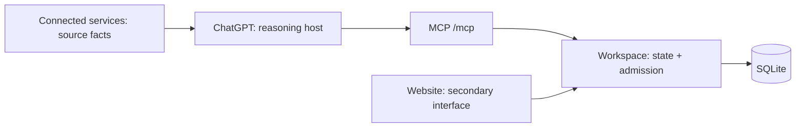

# Personal AI Workspace

**A persistent, evidence-backed work-state layer for ChatGPT. Conversation is an interface, not the system of record.**

First domain: Job Search. ChatGPT remains the reasoning and interaction host;
Workspace owns durable state, evidence, lifecycle admission and cross-conversation
continuity. See the [authoritative core workflow](docs/architecture/CORE_JOB_WORKFLOW.md).

## Why not only ChatGPT's built-in memory?

- ChatGPT memory preserves useful context; Workspace owns explicit domain records and their history.
- Observation, proposal and admission are separate: source evidence or model confidence does not grant mutation authority.
- Writes are versioned, idempotent and protected by optimistic concurrency.
- Today classification is deterministic server-side logic, and an exact active duplicate returns `POSSIBLE_DUPLICATE` with zero writes; ordinary create authority is not a duplicate override.

## Architecture



Connected services remain authoritative for their native records. The website and
ChatGPT operate over the same Workspace database; neither conversation nor a
presentation surface becomes a second system of record.

## 30-second demo

```text
Conversation A

User: I received a recruiter response for the RSM application.
ChatGPT: Records attributable evidence and proposes RECRUITER_CONTACT.
User: Confirm that transition.
ChatGPT: Admits it with explicit authority and reads back lifecycleVersion 2.

Conversation B

User: What needs attention today?
ChatGPT -> workspace_get_today
RSM appears with its durable state and transition-derived follow-up task.
```

## Status

| Scope | Frozen tag | Evidence |
| --- | --- | --- |
| Spike 1A — local MCP, persistence and continuity | `spike-1a-local-verified-v0.1` | [Results](docs/mvp/INTEGRATION_SPIKE_RESULTS_v0.1.md) |
| Spike 1B — Gmail-to-Workspace cross-app evidence | `spike-1b-cross-app-verified-v0.1` | [Results](docs/mvp/INTEGRATION_SPIKE_1B_RESULTS_v0.1.md) |
| M1 — real application inventory and duplicate protection | `m1-real-application-inventory-verified-v0.1` | [Results](docs/mvp/REAL_JOB_SEARCH_M1_RESULTS_v0.1.md) |
| M2 — durable Tasks and deterministic Today | `m2-task-today-verified-v0.1` | [Results](docs/mvp/REAL_JOB_SEARCH_M2_RESULTS_v0.1.md) |
| M3 — complete approved lifecycle and derived Tasks | `m3-real-lifecycle-verified-v0.1` | [Results](docs/mvp/REAL_JOB_SEARCH_M3_RESULTS_v0.1.md) |

These tags freeze the foundational proofs. Current main has since added an AWS-hosted
shared Workspace, a secondary website, Gmail-backed job workflows, packaged Skills,
candidate and interview-source storage, and a resume editor with Word/PDF export.
Optional external job matching remains disabled. Detailed dated releases and retained
acceptance evidence are in [Project history](docs/HISTORY.md).

## Current state ? 2026-09-10

Today's accepted Today/Jobs layouts and resume spacing, ordering and gutter
navigation are recorded in the [session handoff](docs/mvp/SESSION_CLOSE_2026-09-10.md).
Latest production is `watch-reading-20260910-r1`, deployed September 10 at
21:33 Sydney. Reports now use readable paragraphs and per-feature change/no-change
comparisons. Migration 017 and all existing data were retained.

[OpenAI Platform Watch](docs/strategy/OPENAI_PLATFORM_WATCH.md#directional-reporting-update--2026-09-10)
now has a read-only procedure, one actual scheduled execution check, and a revised
architecture-first report. The weekly ChatGPT task is enabled for Tuesdays at
09:00 Australia/Sydney, first September 15. Revised scheduled insight quality is
still awaiting review. Reports still originate in ChatGPT. Current source now
includes a bounded P0 report/decision entry point: authenticated Web import,
immutable provenance, per-finding human disposition and decision-history readback.
It adds no MCP tool or scheduled-task write path. Production migration and public
release checks and authenticated real-report import/readback passed. A deliberate
human finding disposition remains pending. Recommendations remain advisory. See
the [active contract](docs/architecture/PLATFORM_WATCH_REPORT_DECISIONS.md).

## What's next

The next boundary is operational: prove the first unattended daily Job Tracker run
through its Workspace-owned receipt; a manual success is not a substitute. Autonomous
lifecycle admission, direct LinkedIn/SEEK account integration, generic workflow
automation and optional external job matching remain outside the admitted boundary.
The broader versioned job-intelligence ledger remains a proposed, evidence-first design.
The bounded PAW report-to-decision P0 is deployed with recovery and data-preservation
evidence. The latest reading correction passed 414 tests, both type checks and
build, with desktop/mobile layout checks. Three real report snapshots are imported
and independently verified; deliberate human-decision readback is next. The
[source-based revision](docs/mvp/PLATFORM_WATCH_SOURCE_REFRESH_2026-09-10.md)
rechecks official publications and compares Astra-assisted dossier work, WebMCP
resume collaboration and Gmail event triggers with current PAW behavior. All
three recommendations remain pending; the earlier narrative is historical.
The repo's writing rules are updated, but the saved weekly task still pins
`001bef2589aed8b4c877b95fbd450fcf688de951` and needs a separate prompt update. Per-job
named resume versions remain a separate future increment. See the session handoff
and [P0 result](docs/mvp/PLATFORM_WATCH_REPORT_DECISION_P0_RESULTS_2026-09-10.md)
for acceptance gaps and restart priorities.

## Local setup

For real-data dogfooding on Windows, keep the SQLite database outside both the
repository and OneDrive. `PAW_DB_PATH` is the configuration boundary:

```powershell
npm install
$dataRoot = Join-Path $env:LOCALAPPDATA "PersonalAIWorkspace\data"
New-Item -ItemType Directory -Force -Path $dataRoot
$env:PAW_DB_PATH = Join-Path $dataRoot "workspace.db"
$env:PAW_TIME_ZONE = "Australia/Sydney"
npm run dev
```

The runtime rejects database paths inside the repository or a configured
OneDrive root. Use `/healthz` for a basic health check and `/mcp` with MCP
Inspector or a ChatGPT development connection. `npm run seed` remains only for
the frozen synthetic Spike fixture; real inventory should use
`workspace_create_job_application`.

Before backing up or restoring, stop the Workspace process. Back up the closed
`workspace.db` to a user-controlled encrypted location. To reset, stop the
process and move the DB to a dated quarantine filename before restarting; the
runtime will create and migrate a fresh DB. Startup never deletes existing data.

## Cloud operations

The deployed service runs on Sydney Lightsail. Use the [C1 runtime runbook](docs/cloud/C1_RUNTIME_RUNBOOK.md),
[private MCP transport runbook](docs/cloud/C2_SECURE_MCP_TUNNEL.md), and
[web operations runbook](docs/cloud/S1_WEB_OPERATIONS_RUNBOOK.md), reconciled with
the current release handoff. Backup, rollback and logical-fingerprint procedures
are in the repository; earlier acceptance results remain indexed as history.

## Verification

Node.js 24 or later is required by package.json.

```text
npm run verify
```

For routine changes, use [risk-based verification](docs/VERIFICATION.md) and reuse
valid evidence. The command above remains the existing CI/release gate and runs
server/browser type checks, tests and the production build. Local checks
verify code behavior; real ChatGPT authorization, mailbox processing, independent
readback and actual scheduled execution require their own acceptance evidence.
