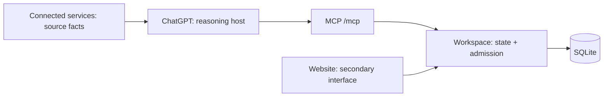

# Personal AI Workspace

**A persistent, evidence-backed work-state layer for ChatGPT. Conversation is an interface, not the system of record.**

Product direction: **The system of record behind your AI agents.** Today, Job
Search through ChatGPT is the primary supported journey; a second client remains
an acceptance milestone. See the [current solution and roadmap](docs/strategy/PRODUCT_SOLUTION_ROADMAP.md)
for ownership boundaries, delivered capabilities and the next release gates.

First domain: Job Search. ChatGPT remains the reasoning and interaction host;
Workspace owns durable state, evidence, lifecycle admission and cross-conversation
continuity. See the [authoritative core workflow](docs/architecture/CORE_JOB_WORKFLOW.md).

## Why not only ChatGPT's built-in memory?

- ChatGPT memory preserves useful context; Workspace owns explicit domain records and their history.
- Observation, proposal and admission are separate: source evidence or model confidence does not grant mutation authority.
- Writes are versioned, idempotent and protected by optimistic concurrency.
- Today classification is deterministic server-side logic, and an exact active duplicate returns `POSSIBLE_DUPLICATE` with zero writes; ordinary create authority is not a duplicate override.

## Architecture



Connected services remain authoritative for their native records. The website and
ChatGPT operate over the same Workspace database; neither conversation nor a
presentation surface becomes a second system of record.

## 30-second demo

```text
Conversation A

User: I received a recruiter response for the RSM application.
ChatGPT: Records attributable evidence and proposes RECRUITER_CONTACT.
User: Confirm that transition.
ChatGPT: Admits it with explicit authority and reads back lifecycleVersion 2.

Conversation B

User: What needs attention today?
ChatGPT -> workspace_get_today
RSM appears with its durable state and transition-derived follow-up task.
```

## Status

| Scope | Frozen tag | Evidence |
| --- | --- | --- |
| Spike 1A — local MCP, persistence and continuity | `spike-1a-local-verified-v0.1` | [Results](docs/mvp/INTEGRATION_SPIKE_RESULTS_v0.1.md) |
| Spike 1B — Gmail-to-Workspace cross-app evidence | `spike-1b-cross-app-verified-v0.1` | [Results](docs/mvp/INTEGRATION_SPIKE_1B_RESULTS_v0.1.md) |
| M1 — real application inventory and duplicate protection | `m1-real-application-inventory-verified-v0.1` | [Results](docs/mvp/REAL_JOB_SEARCH_M1_RESULTS_v0.1.md) |
| M2 — durable Tasks and deterministic Today | `m2-task-today-verified-v0.1` | [Results](docs/mvp/REAL_JOB_SEARCH_M2_RESULTS_v0.1.md) |
| M3 — complete approved lifecycle and derived Tasks | `m3-real-lifecycle-verified-v0.1` | [Results](docs/mvp/REAL_JOB_SEARCH_M3_RESULTS_v0.1.md) |

These tags freeze the foundational proofs. Current main has since added an AWS-hosted
shared Workspace, a secondary website, Gmail-backed job workflows, packaged Skills,
candidate and interview-source storage, and a resume editor with Word/PDF export.
Optional external job matching remains disabled. Detailed dated releases and retained
acceptance evidence are in [Project history](docs/HISTORY.md).

<a id="current-state--2026-09-10"></a>

## Current state — 2026-09-12

The [recoverable candidate screening](docs/architecture/JOB_SCREENING.md)
now includes immutable records, three scoped MCP commands, shared list filtering
and explicit Web keep/withdraw controls. Local verification passed 490 tests,
both type checks/build, migration preservation and synthetic browser recovery.
Migration 020 and the 34-tool server are deployed as `job-screening-20260912-r1`.
Production-copy recovery, preservation of 47 prior business tables, public checks
and authenticated list/detail acceptance passed. Subsequent real-client screening
acceptance is recorded below; external matching remains off.

The subsequent real-client attempt exposed the missing confirmed-profile MCP
write entry. It is fixed and deployed as `screening-profile-20260912-r1`: **35 tools**,
including `workspace_record_screening_profile`, with 496 passing tests and production
copy/readback checks. Jun's September 12 ChatGPT readback feedback confirms the
profile at v1 / CONFIRMED and Google screening at v1 / USER_CONFIRMATION_REQUIRED:
the required 5-year tenure is UNKNOWN, not FILTER; candidate v2 / DISMISSED remains
unchanged. The [real acceptance record](docs/architecture/JOB_SCREENING.md#real-client-acceptance-and-jd-ingestion-gap--september-12)
distinguishes this user-supplied evidence from release probes. Next: a controlled
candidate JD ingestion entry, then real 8+/10+ FILTER → explicit KEEP acceptance.
The other nine candidates lack saved JDs; the proposed Accenture target is not yet
ingested or screened.

The candidate JD admission follow-up is now implemented and locally verified:
`workspace_record_candidate_job_description` saves attributable full text with
candidate-version/JD-hash checks and durable retry receipts. Source inventory is
36 tools; 502 tests, both type checks and build passed. Deployment/readback and
the real 10+ FILTER → KEEP gate are tracked in the linked screening contract.

September 12 [connector preflight](docs/architecture/CANDIDATE_MATCH_GRADES.md#september-12-connector-acceptance-preflight)
confirmed live candidate-summary reads, but that session still exposed the old
client schema without assessment-context options or the assessment save command.
The later screening workflow above confirms refreshed-client use; real letter-grade
write acceptance remains pending. Nine candidates lack JDs; the only saved-JD
candidate is dismissed, so a real assessment target and its inputs remain to be selected.
The [daily receipt readback](docs/mvp/DAILY_WORKFLOW_ACCEPTANCE.md#september-12-receipt-readback)
verifies today's 08:00 SCHEDULED-labelled COMPLETE/CLOSED run, both matching-mail
scopes, empty queues and zero business additions. Its execution reference is empty;
independent hosted-trigger correlation and scheduled website acceptance remain open.

The September 11 [session closeout and next steps](docs/HISTORY.md#september-11-session-closeout)
consolidate the accepted release and remaining real-use gates.

Deployed follow-up: [candidate JD match grades](docs/strategy/PRODUCT_SOLUTION_ROADMAP.md#candidate-match-grades)
now have versioned evidence storage, immutable history, preparation reads, an
interactive MCP save command and Jobs display. Release `candidate-grades-20260911-r1`
became healthy at 20:32 Sydney. The [production record](docs/architecture/CANDIDATE_MATCH_GRADES.md#september-11-production-release)
confirms migration 019, backup/recovery rehearsal, preservation of all 46 prior
business tables, five public checks and running-server discovery of 31 MCP tools.
The release reuses 444 passing tests, both type checks/build and desktop/390px
browser evidence for the same runtime source. Authenticated Jobs list/detail checks passed;
real grade saving and refreshed ChatGPT connector use remain
separate acceptance gates. Backend model matching remains off.

Deployed follow-up: [resume creation belongs in Jobs](docs/architecture/RESUME_VARIANTS.md#september-11-application-page-correction).
Application details retain submitted-material records and omit working-copy
preparation controls. Release `application-resume-ui-20260911-r1` deployed at
17:52 Sydney; 426 tests and production rendering readback passed.

The accepted Today/Jobs layouts and resume spacing, ordering and gutter
navigation are recorded in the [session handoff](docs/mvp/SESSION_CLOSE_2026-09-10.md).
Preceding production was `application-list-20260911-r1`, deployed September 11 at
16:34 Sydney with migration 018 unchanged. The [application list](docs/mvp/APPLICATION_CALENDAR_2026-09-09.md#september-11-application-list-follow-up)
now defaults to recent application/email updates, so undated new applications are
visible near the top; real readback verified One51, Nuix and Coates first.
The preceding calendar/library release's
missing submission dates use
matching confirmation-mail dates with an explicit label in the
[calendar](docs/mvp/APPLICATION_CALENDAR_2026-09-09.md#confirmation-date-display--september-11).
The [library](docs/architecture/JOB_LIBRARY_WORKFLOW.md#current-operating-choice)
shows distinct Word content and authored corrections, omitting PDF imports and
duplicate bodies from display/search/matching snapshots.

Named per-job working copies, delivered earlier the same day, support
independent editing, save/reopen, preview and Word/PDF export. Real Nuix-copy
acceptance preserved saved base version 8. The final education separator was
corrected; the real base PDF has two pages with unchanged body text. See the
[release and acceptance record](docs/architecture/RESUME_VARIANTS.md).
R2's [single-application preparation context](docs/architecture/APPLICATION_PREPARATION_CONTEXT.md)
is deployed through the existing `workspace_get_project` read. Real Nuix v3
readback and a qualified preparation example passed; complete-dossier real use
and refreshed connector explicit-selection acceptance remain pending. It adds
working-resume selection, material gaps and history bounds without another tool
or migration.
The [repeatable MCP read check](docs/architecture/APPLICATION_PREPARATION_CONTEXT.md#repeatable-mcp-read-check--september-11-follow-up)
records call count, response size, material gaps and exact resume selection;
the [release ledger](docs/architecture/APPLICATION_PREPARATION_CONTEXT.md#production-release-and-bounded-real-use-acceptance--september-11)
records production evidence and the remaining material/client gaps.
The preceding Watch reading release retains readable paragraphs and per-feature
change/no-change comparisons.

[OpenAI Platform Watch](docs/strategy/OPENAI_PLATFORM_WATCH.md#directional-reporting-update--2026-09-10)
now has a read-only procedure, one actual scheduled execution check, and a revised
architecture-first report. The weekly ChatGPT task is enabled for Tuesdays at
09:00 Australia/Sydney, first September 15. Revised scheduled insight quality is
still awaiting review. Reports still originate in ChatGPT. Current source now
includes a bounded P0 report/decision entry point: authenticated Web import,
immutable provenance, per-finding human disposition and decision-history readback.
It adds no MCP tool or scheduled-task write path. Production migration and public
release checks and authenticated real-report import/readback passed. A deliberate
human finding disposition remains pending. Recommendations remain advisory. See
the [active contract](docs/architecture/PLATFORM_WATCH_REPORT_DECISIONS.md).

## What's next

The [September 11 roadmap](docs/strategy/PRODUCT_SOLUTION_ROADMAP.md#5-project-roadmap)
records R1's accepted per-job resume copies and R2's deployed read-only
application preparation context with bounded real Nuix acceptance. Complete-dossier
and refreshed connector selection checks remain pending. R3 candidate-grade storage,
reads and Jobs display are deployed and authenticated pages verified. Real-grade and connector acceptance are next.
Daily unattended-run acceptance and Watch decision
quality remain separate operational tracks. Generic Spaces, agent runtimes and
workflow engines are outside this plan.

The next boundary is operational: prove the first unattended daily Job Tracker run
through its Workspace-owned receipt; a manual success is not a substitute. Autonomous
lifecycle admission, direct LinkedIn/SEEK account integration, generic workflow
automation and optional external job matching remain outside the admitted boundary.
The broader versioned job-intelligence ledger remains a proposed, evidence-first design.
The bounded PAW report-to-decision P0 is deployed with recovery and data-preservation
evidence. The latest reading correction passed 414 tests, both type checks and
build, with desktop/mobile layout checks. Three real report snapshots are imported
and independently verified; deliberate human-decision readback is next. The
[source-based revision](docs/mvp/PLATFORM_WATCH_SOURCE_REFRESH_2026-09-10.md)
rechecks official publications and compares Astra-assisted dossier work, WebMCP
resume collaboration and Gmail event triggers with current PAW behavior. All
three recommendations remain pending; the earlier narrative is historical.
On September 11 the saved weekly task was synchronized to
`a7d9006ad8f55bd5fa4c0038e5201bec10c038de` and verified after reopening; its
Tuesday 09:00 schedule is unchanged. [Named per-job resume versions](docs/architecture/RESUME_VARIANTS.md)
are deployed and real-copy accepted. R2 is deployed with bounded real Nuix
acceptance; complete-dossier and refreshed connector checks remain pending. See the session handoff
and [P0 result](docs/mvp/PLATFORM_WATCH_REPORT_DECISION_P0_RESULTS_2026-09-10.md)
for acceptance gaps and restart priorities.

## Local setup

For real-data dogfooding on Windows, keep the SQLite database outside both the
repository and OneDrive. `PAW_DB_PATH` is the configuration boundary:

```powershell
npm install
$dataRoot = Join-Path $env:LOCALAPPDATA "PersonalAIWorkspace\data"
New-Item -ItemType Directory -Force -Path $dataRoot
$env:PAW_DB_PATH = Join-Path $dataRoot "workspace.db"
$env:PAW_TIME_ZONE = "Australia/Sydney"
npm run dev
```

The runtime rejects database paths inside the repository or a configured
OneDrive root. Use `/healthz` for a basic health check and `/mcp` with MCP
Inspector or a ChatGPT development connection. `npm run seed` remains only for
the frozen synthetic Spike fixture; real inventory should use
`workspace_create_job_application`.

Before backing up or restoring, stop the Workspace process. Back up the closed
`workspace.db` to a user-controlled encrypted location. To reset, stop the
process and move the DB to a dated quarantine filename before restarting; the
runtime will create and migrate a fresh DB. Startup never deletes existing data.

## Cloud operations

The deployed service runs on Sydney Lightsail. Use the [C1 runtime runbook](docs/cloud/C1_RUNTIME_RUNBOOK.md),
[private MCP transport runbook](docs/cloud/C2_SECURE_MCP_TUNNEL.md), and
[web operations runbook](docs/cloud/S1_WEB_OPERATIONS_RUNBOOK.md), reconciled with
the current release handoff. Backup, rollback and logical-fingerprint procedures
are in the repository; earlier acceptance results remain indexed as history.

## Verification

Node.js 24 or later is required by package.json.

```text
npm run verify
```

For routine changes, use [risk-based verification](docs/VERIFICATION.md) and reuse
valid evidence. The command above remains the existing CI/release gate and runs
server/browser type checks, tests and the production build. Local checks
verify code behavior; real ChatGPT authorization, mailbox processing, independent
readback and actual scheduled execution require their own acceptance evidence.
