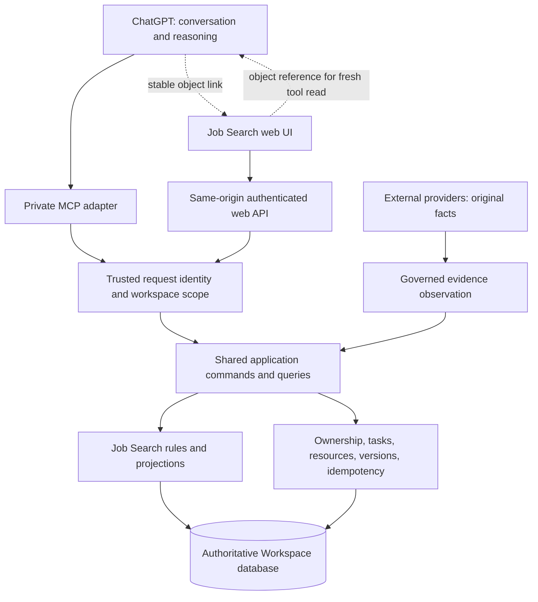

# Domain Secondary Interfaces — Design Proposal v0.1

**Status:** PROPOSED; design review only, 2026-09-05.

**Runtime impact:** None. This proposal does not implement a UI, provision web
ingress, change authentication, migrate data, or admit another domain.

**Input:** User-supplied “Multi-Domain Secondary Interface Requirements”,
particularly the repository assessment and A–F outputs requested in sections 18–19.

The product direction is sound: ChatGPT provides conversation and reasoning;
Workspace owns durable business state; domain interfaces provide structured
inspection and governed operations. Implement this through two adapters over
the existing application services, with one database. Start with Job Search.

## A. Current-state assessment

| Area | Evidence in the repository | Consequence |
| --- | --- | --- |
| Transport separation | [HTTP adapter](../../src/mcp/http-app.ts) delegates to [WorkspaceService](../../src/application/workspace-service.ts) | Add a web adapter over application services; do not implement business rules in browser handlers. |
| Ownership | Principal, Workspace and project-scoped records exist in [persistence](../../src/persistence) | Preserve workspace ownership checks for every object and child-object lookup. |
| Mutation controls | [TaskService](../../src/application/task-service.ts) and lifecycle admission implement transactions, version checks and idempotency | Reuse these commands, including their existing terminal-state and derived-task behavior. |
| Identity | [Server startup](../../src/server.ts) constructs one service with a configured development principal | This is not browser login or per-request authentication. A public UI cannot inherit that identity for arbitrary requests. |
| Domain coupling | [Types](../../src/domain/types.ts) use Job Application lifecycle states; `getAuthorizedProject` validates that lifecycle | `projectType: string` does not make the current Project implementation domain-neutral. |
| Today | [TodayQueryService](../../src/application/today-query-service.ts) returns company/role and application-specific groups | Its task and recent-transition queries lack a project-type filter. Adding other project types without separating domain queries would mix semantics. |
| Read completeness | `listJobApplications` caps results at 100; `getProject` returns ten resources, ten transitions and open tasks | The UI needs explicit limits and additional bounded queries. A completed task cannot be verified by its disappearance alone. |
| History/audit | Transitions retain lifecycle evidence and admission information; tasks retain current version and actor categories | There is no complete, actor-attributed event history for every metadata/task edit. Do not advertise a comprehensive audit trail yet. |
| Cloud | [C4/C5 evidence](../cloud/C4_C5_RUNTIME_RESULTS_v0.1.md) records accepted cloud access with the Windows-off condition attested by the user | Always-on MCP groundwork is complete; browser ingress and browser authentication remain separate work. |

The existing [M4 evaluation boundary](../dogfood/M4_REAL_USE_EVALUATION_v0.2.md)
says: “The feature freeze continues through the Day 28 decision.” It explicitly
excludes a UI, new tools and schema expansion. Day 28 is 2026-10-01. This document
is compatible design work. Runtime implementation follows that gate, or a
separate explicit decision changing the evaluation scope; this review does not
silently make that decision.

### Shared concepts versus existing implementation

Retain cross-domain ownership, stable identifiers, task status/priority/due dates,
resource provenance, evidence references, version checks, idempotent execution,
authority records and transaction infrastructure. Their semantics should be
consistent without requiring every object to share one business schema.

Keep company/role, application registration, posting matching, application
lifecycle, lifecycle-derived task kinds and Job Search attention classification
inside Job Search. Evidence interpretation is domain-specific even where the
resource envelope is shared. A generic Event model and universal audit API are
future capabilities, not primitives fully delivered by the current tables.

## B. Proposed target architecture

Keep the current modular backend and SQLite deployment. Serve a small responsive
web app and its API from the same HTTPS origin. A new web transport must be
explicitly routed; keep the existing MCP tunnel/private endpoint boundary intact.
The [current MCP tunnel](../cloud/C2_SECURE_MCP_TUNNEL.md) is not a general browser
hosting service. Select HTTPS ingress and an identity provider in the first
implementation slice, including operating cost and rollback; provision neither
as part of this proposal.

### Authentication and authorization

Use a managed login flow with an allowlisted initial user. Both adapters resolve
to the same internal Principal and Workspace, while retaining different transport
credentials. Introduce an immutable request context containing principal,
workspace and channel; never switch identity on a shared singleton between
requests. The private MCP adapter can retain its trusted configured identity
until its own authentication migration is approved.

Explicitly link the verified web issuer/subject to the existing principal so
login opens the existing inventory. Do not auto-link by email or silently create
an empty replacement workspace. Cross-domain access shares this identity and
ownership policy; a broad roles/admin system is unnecessary for the first user.
This follows the boundary in [ADR-007](../adr/ADR-007-identity-auth-boundary.md).

Use server-managed sessions with Secure, HttpOnly, SameSite cookies; keep tokens
out of URLs and browser storage. Protect write requests with CSRF tokens and
origin verification, and make GET requests read-only. SameSite alone is not the
write-authorization mechanism. These controls follow [OWASP session guidance](https://cheatsheetseries.owasp.org/cheatsheets/Session_Management_Cheat_Sheet.html)
and [OWASP CSRF guidance](https://cheatsheetseries.owasp.org/cheatsheets/Cross-Site_Request_Forgery_Prevention_Cheat_Sheet.html).

If a future public MCP connection uses OAuth, implement its resource/token
validation at that adapter. Sharing the Principal model does not mean copying
ChatGPT credentials into the browser. See [OpenAI MCP authentication](https://developers.openai.com/plugins/build/auth).

### API and command boundary

The following are proposed web contracts, not endpoints already available.
Handlers authenticate, validate transport input, call application services and
map results/errors. Browser code cannot access SQL or independently admit state.

| Proposed surface | Application responsibility |
| --- | --- |
| `GET /api/v1/job-search/today` | Existing deterministic Job Search attention, with date/timezone and freshness. |
| `GET /api/v1/job-search/applications` | Authorized filter/sort/pagination, total count and task summary; avoid one detail request per row. |
| `GET /api/v1/job-search/applications/{id}` | Current authorized project detail, versions and explicit resource/history bounds. |
| `GET /api/v1/job-search/applications/{id}/tasks` | Bounded status-filtered results including DONE and CANCELLED. |
| `GET /api/v1/job-search/tasks/{id}` | Authorized readback of a specific task, including terminal status and version. |
| `GET /api/v1/job-search/applications/{id}/history` | Bounded lifecycle/evidence history with explicit coverage; no invented older task-edit events. |
| Later task/metadata command routes | Delegate to existing create/update application commands. |
| Later proposal/admission routes | Delegate to existing observe/propose/admit semantics, with explicit user intent. |

Add read queries in the application layer where current methods cannot supply
these views. Keep frozen MCP contracts intact; exposing new MCP capabilities is
its own gated change. Stable cursors and deterministic ordering must work beyond
100 applications and ten history items; initial screens must label incomplete
data until pagination is available.

For writes, preserve each command's actual authority contract. Task mutation and
lifecycle admission currently validate explicit development authority; metadata
update has a different input contract. Do not pretend all commands already take
the same authority payload, or grant authority merely because a client sends
`confirmed: true`. The trusted adapter records the authenticated actor and the
specific user action; domain commands enforce policy.

Retain distinct expected record and lifecycle versions. One user intent gets one
idempotency key reused on retry; the same key with another payload conflicts.
Use transport-independent command identities so retries cannot double-execute
through different adapters. On version conflict, return a conflict response,
show refreshed state and require a new decision for a changed intent. Do not
silently rebase and admit an old action. Transactions must continue to couple
lifecycle admission, derived tasks and terminal task cancellation.

Before UI writes, define the missing audit coverage: actor, channel, command ID,
target, authority reference, relevant before/after values or versions, outcome
and timestamp. Record durable successful mutation audit atomically; keep failure
telemetry separate and minimized. Do not label a partial timeline “all changes”.

### Deep links in both directions

Use stable routes such as `/workspace/job-search/applications/{projectId}` and
`/workspace/job-search/tasks/{taskId}`. Build absolute links from a configured
allowed UI origin, not arbitrary request headers. Login preserves an allowed
local return path; every eventual object read still checks ownership. IDs in a
URL confer no access. Do not embed credentials or email content in links.

ChatGPT can include the object's UI link after a governed read. An additive
`viewUrl` or link resolver is a later contract change, not a reason to overload
business metadata. From the UI, the baseline is “Copy context for ChatGPT” plus
an open-ChatGPT action: a short user-readable prompt with domain, object ID and
the intended question. ChatGPT reads fresh state through MCP after user submission.
Provide a selectable-text fallback where clipboard access fails.

This baseline does not promise automatic injection into an arbitrary ChatGPT
conversation. In a supported embedded MCP UI, host messaging can improve the
handoff: current documentation lists `ui/message` and the compatibility alias
`window.openai.sendFollowUpMessage`. That is an optional adapter capability, not
a standalone website API or a dependency of Workspace. See [OpenAI embedded UI integration](https://developers.openai.com/plugins/build/chatgpt-ui).

## C. Smallest useful Job Search interface

Start with two structured views and a Today entry:

1. **Application inventory:** company, role, lifecycle, location, next due task,
   open-task count and last update; filter active/closed and lifecycle, sort and
   search. Show applications without open tasks as a distinct gap signal.
2. **Application detail:** current state, actual admitted lifecycle timeline,
   open/completed/cancelled tasks, evidence links and visible data coverage.
   Show a preparation task alongside its relevant lifecycle event.
3. **Today:** reuse deterministic attention and upcoming work. Preserve existing
   classification, including its special handling of undated high-priority
   tasks. Display Sydney dates and reason labels; do not convert “no open task”
   into an invented deadline or double-count a task with multiple reasons.

Desktop uses a compact table; iPhone uses compact labeled rows and a readable
detail view. Support keyboard access, loading/empty/error states, refresh and
visible last-read time. An unsuccessful save must retain the user's form input
and must not display success. Do not show stale cached content as current state.

The first read-only slice already adds value through scanning, filtering and
durable completed-task inspection. Next add individual task completion, priority
and due-date edits and supported task creation. Add metadata editing separately.
Lifecycle admission follows later with a from/to preview, evidence and visible
derived-task/cancellation effects. Do not make a drag-and-drop pipeline silently
admit transitions. Timeline rendering must allow actual edges such as
APPLIED directly to INTERVIEWING; never invent an intermediate recruiter event.

Defer charts, bulk operations, full resume/JD analysis and custom conversation UI.
Only display structured resume relationships when the corresponding durable
model exists; the current proposal in [Job Search Intelligence](JOB_SEARCH_INTELLIGENCE_ARCHITECTURE_v1.md)
does not make those records available today.

### Missing requirement: discovered jobs and recommendation history

The user's daily 09:00 Sydney ChatGPT digest is currently an external scheduled
workflow with read-only application filtering. Its schedule and recommendations
are not Workspace records. Adding an Applications UI alone does not integrate it.

Add a separate, small candidate-management requirement: a not-yet-applied job
with source URL/provider ID, company/role/location, observed time, a short
directional fit reason and uncertainty, plus durable saved/dismissed decisions
and recommendation history. Keep the reason advisory; no detailed score or
skills taxonomy is needed for the user's requested lightweight digest.

Define a workspace-owned candidate object separately from `Project(job_application)`.
The existing intelligence proposal's `ApplicationPosting` is application-bound;
it should not be stretched silently to represent every discovered job. Specify
candidate-to-application linking and evidence reuse before implementing that
small schema addition. Recommend/save does not mean APPLIED; create or link an
application only on an authorized record of an actual application.

A minimal digest run/item ledger should retain stable source identity, run time,
selected candidate IDs, attempted delivery and known delivery outcome. Record
“delivery unknown” if no acknowledgment exists. Deduplicate by provider posting
identity/canonical URL; preserve ambiguous matches for review. Track source
coverage and failures so “no new jobs” differs from “search unavailable”.

For this product to own candidate history, the digest must gain a narrowly scoped,
authorized recording command and write/readback verification. Existing read-only
access does not provide this. Scheduling and notifications can remain in ChatGPT
while Workspace owns candidate decisions and recommendation records. This does
not require a new backend scheduler. Candidate integration is a separate gated
slice, which can precede a richer UI if daily recommendation continuity is the
most useful next outcome.

## D. Future-domain extension model

Use a single static navigation entry for Job Search now. A small route/label
configuration is enough; no database registry or plugin engine is needed.

When a real second domain is admitted, introduce a common ownership envelope
with typed domain details. For example, a Travel project owns dates/destination
and bookings; its module owns trip-specific lifecycle and booking constraints.
Reuse task status, due dates, resource references and mutation infrastructure.
Do not add travel states to the existing Job Application lifecycle union or run
travel records through `getAuthorizedProject`'s current job-specific validator.
Make that separation, plus explicit domain query scoping, before storing the
first non-job project. Choose its actual lifecycle from real usage requirements.

Travel's own query classifies attention such as an approaching booking deadline.
A future top-level Today view aggregates small envelopes containing domain key,
stable object reference, reason codes, due time, observation time and view link.
Keep domain classification authoritative and aggregation deterministic. ChatGPT
can explain tradeoffs separately; do not persist its inferred ranking as policy.

Defer dynamic schemas/forms, universal lifecycle engines, domain plugins, event
buses, global resource deduplication, cross-domain scoring and generic dashboards
until a second implemented domain demonstrates the specific need. Preserve the
Job Search command contract when extracting the necessary seams.

## E. Risks and release evidence

| Risk | Mitigation and concrete evidence |
| --- | --- |
| Over-generalization | Deliver Job Search with a static route map; no speculative migrations for other domains. |
| Duplicate state | UI drafts remain transient; success requires server acknowledgment and readback. Candidate decisions move to Workspace only through an explicit new integration. |
| Authority bypass | Exercise unauthenticated, wrong-owner, forged-authority, stale-version and duplicate-intent commands at the server boundary. |
| Identity split | Verified web login and existing private MCP read the same workspace IDs and existing inventory; other accounts receive no data. |
| Partial history mistaken for deletion | Complete a task, read it directly, reload on another device and find it in completed tasks. Test pagination beyond current caps. |
| ChatGPT-specific coupling | Standalone UI works without host SDK globals; failed handoff still exposes a copyable stable context reference. |
| Decorative dashboard | User can identify and open overdue work, inspect multiple applications and locate a completed task without reconstructing a conversation. |
| Public ingress weakens private runtime | Authenticate web routes before data access; private MCP remains inaccessible through unapproved public routing. |
| Operational regression | Verify restart, backup/restore compatibility, current MCP behavior and an iPhone flow while Windows is off. |

## F. Recommended gated sequence

| Slice | Deliverable | Exit gate |
| --- | --- | --- |
| 0 — now | This proposal and explicit product scope, including candidate ownership | Design review; no runtime changes during the existing evaluation freeze. |
| 1 — after scope gate | Concrete single-user auth/ingress design and immutable identity adapter seam | Existing Principal preserved; authentication design meets ADR-007 before any public release; regression and unauthorized-access checks pass. |
| 2 | Read API and responsive inventory/detail/Today views | Deep links survive login; terminal tasks remain inspectable; counts and history coverage are truthful; mobile read works with Windows off. |
| 3 | Individual task commands and scoped audit coverage | Duplicate retry executes once; version conflict is visible; terminal-state rules hold; MCP readback agrees. |
| 4 | Metadata and separately reviewed lifecycle controls | Evidence, authority, versions and lifecycle side effects match existing application commands; no UI-only policy. |
| C — independent scope gate | Lightweight candidate records and digest run/item handoff | One digest records and rereads candidates without creating false applications; repeated run does not duplicate history; delivery uncertainty is visible. |
| 5 | Dogfood the first domain interface | Evaluate scanning, completed-task retrieval, cross-entry consistency and actual repeated use before expanding views. |
| 6 | Evaluate one real second domain | Demonstrated recurring state/coordination need; extract only the seams that domain requires. |

Slice C can follow the authentication/service boundary decision and need not wait
for lifecycle controls. If the immediate priority is bringing the daily digest
into Workspace, prioritize C over slices 3–4. Neither accepting this design nor
the existing ChatGPT schedule establishes that the candidate integration is live.

**Review validation:** Repository and contract inspection; documentation link and
whitespace checks. Runtime/security acceptance checks above are future release
gates, not tests claimed to have run for this document.
