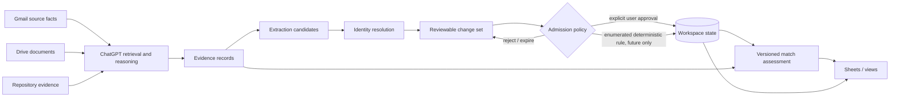

# Job Search Intelligence Architecture v1

**Status:** PROPOSED POST-M4 BASELINE

**Runtime impact:** NONE during the active M4 feature freeze

**Decision record:** [ADR-012](../adr/ADR-012-job-search-intelligence-boundary.md)

## 1. Purpose and boundary

Job Search Intelligence extends the durable Job Application model with
evidence-backed job descriptions, resume versions, skill requirements,
match assessments, and reviewable change sets.

It does not make Gmail, Drive, a spreadsheet, a model, or a conversation the
system of record for Workspace state. It also does not authorize a lifecycle
mutation merely because a source message or model analysis appears confident.

The target flow is:



During M4, this document is design input only. No connector, scheduler,
migration, new MCP tool, model call, automatic admission, or spreadsheet sync
is introduced by accepting this architecture.

## 2. Canonical data model

The model separates durable work state, external evidence, source documents,
and analytical output. A value may be displayed together in a UI without
being stored as one denormalized record.

### 2.1 Existing durable objects

- `Project(job_application)` owns application identity and lifecycle.
- `StateTransition` owns lifecycle history and admission authority.
- `Task` owns actionable work independently of lifecycle.
- `Resource` references minimized external evidence.
- `Action` and `Outcome` remain the intended execution/audit records.

These objects remain authoritative for their existing concerns.

### 2.2 Proposed intelligence objects

#### ApplicationPosting

One application can reference a posting even when the original page later
expires. Multiple observed URLs may resolve to the same posting.

```yaml
id: uuid
workspace_id: uuid
project_id: uuid
company_normalized: string
role_normalized: string
location: string?
source_resource_id: uuid
source_status: EXACT | COMPARABLE | INFERRED
observed_at: timestamp
content_hash: string?
record_version: integer
created_at: timestamp
updated_at: timestamp
```

`EXACT` means evidence identifies the application-specific posting.
`COMPARABLE` means an official same-family posting informs directional
analysis but is not asserted to be the applied role. `INFERRED` means the
identity is derived from indirect evidence and must not silently update the
canonical application identity.

#### ResumeArtifact

```yaml
id: uuid
workspace_id: uuid
provider: google_drive | other
external_id: string
external_uri: string?
file_name: string
mime_type: string?
modified_at: timestamp?
content_hash: string?
observed_at: timestamp
```

This is a reference and fingerprint, not a copy of the complete resume.

#### ApplicationResume

```yaml
id: uuid
project_id: uuid
resume_artifact_id: uuid
relationship: SUBMITTED | RECOMMENDED
evidence_resource_ids: [uuid]
confidence: HIGH | MEDIUM | LOW
confidence_reason: string
valid_from: timestamp
valid_to: timestamp?
record_version: integer
```

`SUBMITTED` is a claim requiring provenance. File-name or timestamp proximity
alone may support `HIGH` confidence, but does not become `CONFIRMED` without a
source-system record that exposes the submitted artifact.

#### Skill

```yaml
id: stable_slug
canonical_name: string
category: LANGUAGE | FRAMEWORK | CLOUD | DATA | ML_AI | DELIVERY | GOVERNANCE | DOMAIN | SOFT_SKILL
aliases: [string]
taxonomy_version: string
```

Aliases normalize spelling without erasing meaningful distinctions. For
example, a generic `vector_database` skill must not be treated as proof of
product-specific `pgvector` experience.

#### PostingRequirement

```yaml
id: uuid
posting_id: uuid
skill_id: stable_slug
importance: MUST_HAVE | PREFERRED | CONTEXT
weight: decimal
evidence_locator: string
extraction_confidence: HIGH | MEDIUM | LOW
analysis_run_id: uuid
```

Every requirement points to the posting evidence that supports it. A model
cannot add an unsupported requirement from general market knowledge.

#### CapabilityEvidence

```yaml
id: uuid
workspace_id: uuid
skill_id: stable_slug
subject_type: RESUME_ARTIFACT | REPOSITORY | PROJECT | USER_ASSERTION
subject_reference: string
evidence_resource_ids: [uuid]
strength: DEMONSTRATED | CLAIMED | ADJACENT
evidence_locator: string?
observed_at: timestamp
```

`DEMONSTRATED`, `CLAIMED`, and `ADJACENT` are deliberately different. A
repository with tests can demonstrate engineering practice; a resume line is
a claim; a related framework may be adjacent but not equivalent experience.

#### AnalysisRun

```yaml
id: uuid
workspace_id: uuid
analysis_type: JD_EXTRACTION | RESUME_EXTRACTION | MATCH | AGGREGATE_SKILLS
ruleset_version: string
taxonomy_version: string
model_provider: string?
model_name: string?
prompt_or_config_hash: string?
input_manifest_hash: string
started_at: timestamp
completed_at: timestamp?
status: RUNNING | SUCCEEDED | FAILED
```

#### MatchAssessment

```yaml
id: uuid
project_id: uuid
posting_id: uuid
submitted_resume_relationship_id: uuid?
analysis_run_id: uuid
score_low: integer
score_high: integer
band: STRONG | GOOD | PARTIAL | UNSCORED
confidence: HIGH | MEDIUM | LOW
coverage_summary: object
gap_summary: object
supersedes_assessment_id: uuid?
created_at: timestamp
```

Assessments are append-only analytical records. A rerun creates a successor;
it does not overwrite the assumptions behind the previous score.

#### ProposedChangeSet

```yaml
id: uuid
workspace_id: uuid
source_scan_id: uuid?
target_project_id: uuid?
candidate_changes: [FieldChange]
evidence_resource_ids: [uuid]
confidence: HIGH | MEDIUM | LOW
risk: LOW | MATERIAL | HIGH
status: PROPOSED | APPROVED | REJECTED | EXPIRED | APPLIED | FAILED
policy_version: string
created_at: timestamp
decided_at: timestamp?
applied_at: timestamp?
authority_reference: string?
```

Each `FieldChange` records the target object and field, previous value,
proposed value, evidence, and whether the change affects lifecycle state.

## 3. Authority and system-of-record matrix

| Concern | Authority | Workspace stores | Presentation |
| --- | --- | --- | --- |
| Email content and delivery metadata | Gmail | Stable reference plus minimized observed facts | Linked evidence |
| Resume/JD file bytes | Google Drive or original provider | Artifact identity, fingerprint, relationship, provenance | File link and confidence |
| Public posting page | Publishing site | Resource reference, observation time, optional hash, extracted requirements | JD link and source status |
| Application lifecycle and Tasks | Workspace | Canonical state, versions, transitions, authority | Today and application views |
| Skill taxonomy | Workspace versioned ruleset | Canonical skills and aliases | Skill trend views |
| Match score | Workspace analytical ledger | Immutable assessment plus complete input manifest | Job Intelligence / Overview |
| Spreadsheet cells | No independent authority | Optional projection checkpoint only | Human-facing operational view |
| GitHub project evidence | Repository/provider | Reference, revision, evidence locator, observed facts | Capability evidence |
| Conversation/model output | No independent authority | Only admitted structured records with provenance | Explanation and proposal |

The Workspace is the canonical cross-system work-state and intelligence
ledger. External providers remain canonical for their native objects. Google
Sheets is a projection and review surface; manual spreadsheet corrections
must be reconciled into Workspace or explicitly marked as display-only.

## 4. Approval-oriented ingestion pipeline

### 4.1 Pipeline stages

```text
SCAN -> OBSERVE -> EXTRACT -> RESOLVE -> PROPOSE -> REVIEW -> APPLY -> VERIFY
```

1. `SCAN` reads only the provider scope authorized by the user.
2. `OBSERVE` records minimized, attributable facts and stable source IDs.
3. `EXTRACT` creates candidates; it does not mutate application state.
4. `RESOLVE` links a candidate to exactly one Project or reports ambiguity.
5. `PROPOSE` creates a field-level change set with risk and confidence.
6. `REVIEW` records user approval, rejection, expiry, or a future enumerated
   policy decision.
7. `APPLY` performs an idempotent, optimistic-concurrency-protected mutation.
8. `VERIFY` reads back Workspace state and refreshes projections.

Failure at any stage preserves the source observation and records the failure;
it does not skip directly to a write.

### 4.2 Change risk

| Risk | Examples | v1 admission rule |
| --- | --- | --- |
| LOW | Add a non-canonical evidence reference; refresh an analytical projection | Explicit review; future deterministic policy may be proposed separately |
| MATERIAL | Change role, posting, submitted resume relationship, skill requirements, match inputs | Explicit user approval |
| HIGH | Change lifecycle, close a Project, send/apply/withdraw, overwrite source evidence | Explicit user approval; no model-only admission |

The initial v1 mode is `DRY_RUN`, followed by `REVIEW_REQUIRED`. A possible
future `POLICY_AUTOMATED` mode requires a separate accepted ADR, an explicit
user opt-in, a narrow allow-list, three successful dry runs, rollback or
compensation behavior, and production evidence. It is not enabled here.

### 4.3 Confidence rules

- `HIGH`: exact source identity and internally consistent attributable
  evidence; no unresolved conflict.
- `MEDIUM`: official comparable source or strong indirect evidence, but one
  material identity/input is unconfirmed.
- `LOW`: missing source, ambiguous application identity, stale page, or
  conflicting evidence.

Confidence controls what can be asserted and aggregated. It never grants
mutation authority.

### 4.4 Idempotency and concurrency

- A scan is keyed by connector, account scope, bounded time window, and policy
  version.
- An observation is keyed by provider and stable external ID.
- A proposed change is canonically hashed from target, prior version,
  proposed values, evidence IDs, and policy version.
- Apply requires the expected target record version.
- Replaying a completed apply returns the original result.
- A stale or conflicting proposal becomes `EXPIRED`; it is not silently
  rebased by a model.

## 5. Skill intelligence layer

### 5.1 Scoring contract

The match score is an explainable interval, not a claim of hiring probability.
Its inputs are only:

- requirements extracted from the selected posting version;
- capability evidence from the selected submitted resume version and explicit
  repository/project evidence;
- the versioned taxonomy and ruleset; and
- source and extraction confidence.

Suggested requirement weights are `MUST_HAVE = 3`, `PREFERRED = 1`, and
`CONTEXT = 0` for scoring. Evidence strength can cap credit:

- `DEMONSTRATED`: up to full credit;
- `CLAIMED`: up to normal resume credit;
- `ADJACENT`: partial credit only;
- absent or contradicted: zero credit.

The interval widens when the JD or submitted resume is not exact. `UNSCORED`
is mandatory when the requirements are too incomplete for a defensible
calculation.

Band defaults:

| Band | Score interval guidance |
| --- | --- |
| STRONG | lower bound at least 80 |
| GOOD | lower bound at least 65 |
| PARTIAL | lower bound below 65 with sufficient evidence to score |
| UNSCORED | insufficient or contradictory inputs |

These thresholds are ruleset configuration, not hard-coded domain truth.

### 5.2 Aggregate views

The intelligence layer should derive, not manually maintain:

- demand frequency by canonical skill and requirement importance;
- weighted demand across active applications;
- demonstrated, claimed, adjacent, and missing coverage;
- recurring gaps across exact versus comparable JDs;
- evidence freshness and source-confidence distribution;
- highest-leverage learning or project work by weighted gap coverage;
- resume-language gaps where capability exists but is not expressed; and
- outcome slices by skill pattern after enough non-sensitive evidence exists.

Exact and inferred inputs must never be silently combined. Every aggregate
shows its population, date window, confidence filter, and ruleset version.

### 5.3 Watch rules

Watch rules are read-only derived alerts in v1:

- a high-weight skill gap appears in at least three active exact JDs;
- a submitted resume relationship is `LOW` confidence;
- a JD or resume artifact becomes unavailable or changes hash;
- an assessment is stale because an input or ruleset changed;
- a spreadsheet projection differs from Workspace canonical state; or
- a candidate change remains unreviewed past its expiry.

They do not create Tasks or mutate lifecycle until a separately approved
implementation slice defines that behavior.

## 6. Versioning and traceability

Every displayed intelligence conclusion must answer:

1. Which application and posting version was used?
2. Which submitted resume version was used?
3. Which source observations support those identities?
4. Which taxonomy, ruleset, model/configuration, and analysis run produced it?
5. Which previous assessment does it supersede?
6. Who or what authorized any resulting durable change?

### 6.1 Immutable inputs and append-only analysis

- External resources are referenced by stable provider ID and observation
  time; use a content hash when source terms permit it.
- A changed file/page creates a new observed version or fingerprint.
- An `AnalysisRun` has an immutable input manifest and configuration hashes.
- A `MatchAssessment` is never edited in place after publication.
- Corrections create a successor linked by `supersedes_assessment_id`.
- Projection refreshes record the assessment ID they display.

### 6.2 Field-level provenance

Each material derived field records:

```yaml
value: any
source_resource_ids: [uuid]
analysis_run_id: uuid?
confidence: HIGH | MEDIUM | LOW
assertion_type: OBSERVED | USER_ASSERTED | INFERRED | DERIVED
observed_or_decided_at: timestamp
```

UI labels such as `Exact JD`, `Official comparable JD`, and
`High-confidence resume` are projections of this provenance, not free-form
claims.

### 6.3 Privacy and retention

- Do not copy full Gmail bodies, attachments, signatures, recipient lists, or
  raw headers into Workspace.
- Do not commit real job-search content, provider tokens, resumes, or source
  snapshots to Git.
- Store the minimum excerpt locator or structured fact needed to explain a
  requirement or capability.
- Retention and deletion operate on Workspace references and derived
  assessments without deleting provider-owned source files.

## 7. Delivery slices after M4

Implementation must be gated by the M4 `CONTINUE`, `REVISE`, or `STOP`
decision. If continued, use non-overlapping slices:

1. **J1 — contracts only:** taxonomy, posting/resume relationships,
   provenance contracts, migration, and unit tests; no automation.
2. **J2 — manual intelligence:** explicit tools to register exact/comparable
   sources and create a versioned assessment; read-only aggregate view.
3. **J3 — review queue:** persisted proposed change sets, expiry,
   optimistic concurrency, approval and verification; still no scheduler.
4. **J4 — projection adapter:** explicit, idempotent export/reconciliation for
   Google Sheets; Workspace remains canonical.
5. **J5 — scheduled dry run:** read-only bounded scans that create no durable
   business mutation without the separately approved observation boundary.
6. **J6 — policy evaluation:** only after evidence from at least three clean
   dry runs; decide whether any low-risk allow-listed update may be automated.

Each slice requires migration rollback planning, contract tests, privacy
tests, idempotency tests, cross-Workspace isolation, and a manual ChatGPT
platform gate before it can be called verified.

## 8. Acceptance criteria for this baseline

This architecture is ready for implementation planning when reviewers agree
that:

- every canonical value has one authority;
- exact, comparable, and inferred evidence cannot be confused;
- submitted and recommended resumes are separate versioned relationships;
- match scores can be reproduced from immutable input manifests;
- aggregate skill views expose confidence and population boundaries;
- model output cannot authorize a durable mutation;
- the frozen M4 runtime and evaluation evidence remain unchanged; and
- no real personal job data is required in Git to test the design.
