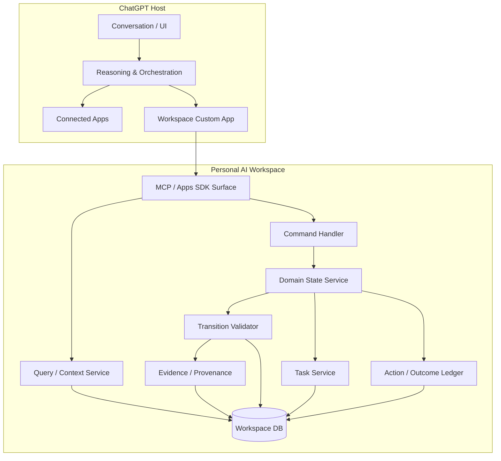

# Logical Architecture v0.1



## Initial ChatGPT-facing capability surface

Keep it small:

```text
workspace.get_today()
workspace.get_project()
workspace.search_projects()
workspace.create_job_application()
workspace.record_observation()
workspace.propose_transition()
workspace.create_task()
workspace.complete_task()
```

Prefer domain actions over low-level CRUD.

Bad:

```text
set_project_field(...)
update_database_row(...)
```

Better:

```text
record_recruiter_contact(...)
record_interview_scheduled(...)
record_application_outcome(...)
```

The final tool granularity is an Integration Spike decision.

## Deliberately absent in MVP

- internal LLM gateway,
- multi-agent runtime,
- generic workflow engine,
- event bus,
- background scheduler,
- analytics platform,
- broad connector framework.

ChatGPT is the initial cognitive/orchestration host.

## Spike 1A deployment interpretation

The boxes in this diagram are logical responsibilities. Spike 1A implements
them as modules in one TypeScript process backed by one SQLite database.

Spike 1A does not introduce:

- service-to-service networking,
- a second API beside the MCP endpoint and health check,
- an authentication administration service,
- an LLM API client,
- external source connectors.

The initial Spike 1A tool surface is limited to:

```text
workspace_ping
workspace_get_project
workspace_record_observation
workspace_propose_transition
workspace_admit_transition
```

`workspace_admit_transition` records user authority; its name does not assign
admission authority to ChatGPT.
