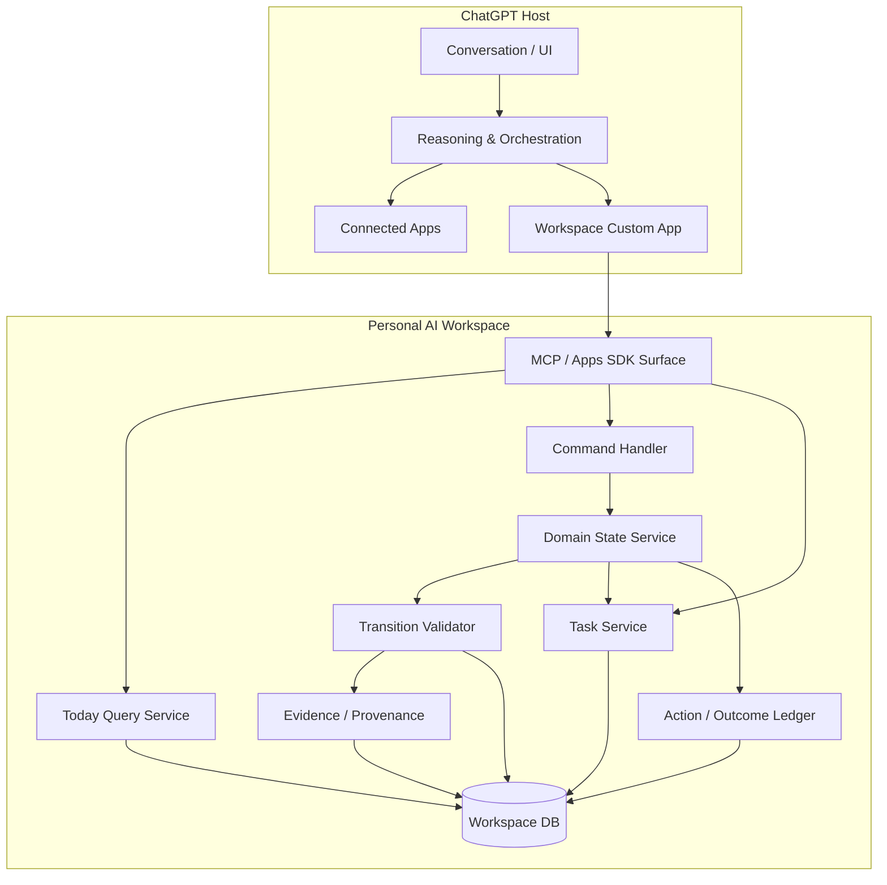

# Logical Architecture v0.1

> This document describes the verified and frozen MVP. The proposed post-M4
> Job Search Intelligence extension is specified separately in
> [`JOB_SEARCH_INTELLIGENCE_ARCHITECTURE_v1.md`](JOB_SEARCH_INTELLIGENCE_ARCHITECTURE_v1.md)
> and does not change the active M4 runtime.



## ChatGPT-facing capability surface

### Verified Spike 1A surface

```text
workspace_ping
workspace_get_project
workspace_record_observation
workspace_propose_transition
workspace_admit_transition
```

### Approved Spike 1B delta

```text
workspace_find_job_application(company, role)
```

This is a read-only domain lookup for the cross-app handoff. It uses exact
normalized company + role matching inside the current Workspace and returns an
explicit `EXACT`, `NOT_FOUND`, or `AMBIGUOUS` result. It is not a generic search
service and does not use fuzzy or model-based matching.

### Real Job Search Slice M1 surface

```text
workspace_create_job_application
workspace_list_job_applications
workspace_update_job_application
```

M1 also bounds `workspace_get_project` while retaining the exact Spike 1B
lookup.

### Real Job Search Slice M2 surface

```text
workspace_create_task
workspace_update_task
workspace_get_today
```

`TaskService` owns the two explicit-authority, idempotent, versioned commands.
`TodayQueryService` owns the read-only timezone/clock-aware derived view. The
MCP adapter routes to those modules; ChatGPT explains and orchestrates their
results but does not calculate Today ordering.

### Real Job Search Slice M3 surface

M3 adds no tool. It expands the existing `workspace_propose_transition`
destination schema and the transactional behavior behind
`workspace_admit_transition` to cover the approved lifecycle graph, derived
Tasks, and terminal Project closure plus open-Task cancellation. The public MCP
surface remains 12 tools.

## Deliberately absent in MVP

- internal LLM gateway,
- multi-agent runtime,
- generic workflow engine,
- event bus,
- background scheduler,
- analytics platform,
- broad connector framework.

ChatGPT is the initial cognitive/orchestration host.

## Proposed post-M4 intelligence extension

The next architecture baseline preserves the existing boundary and adds
versioned analytical records rather than placing inference directly on the
canonical Project:

```text
Connected source facts
    -> minimized evidence
    -> extraction and identity candidates
    -> reviewable change set
    -> authorized Workspace mutation

Versioned JD + submitted resume + capability evidence
    -> immutable analysis run
    -> match assessment and aggregate skill views
    -> Google Sheets / other projections
```

Workspace remains the cross-system work-state and intelligence ledger;
providers own native records, and Sheets remains a projection. Scheduled
ingestion, automatic admission, new tools, and schema changes remain absent
until a post-M4 implementation slice is separately approved and verified.

## Slice M2 deployment interpretation

M2 remains in the same TypeScript process and SQLite database. The dedicated
Task and Today modules are logical/application boundaries, not network
services. There is no stored Today object, scheduler, reminder, connector,
Calendar/Gmail query, or internal model call.

## Slice M3 deployment interpretation

M3 remains in the same TypeScript process, application service, and SQLite
transaction boundary. It adds no schema migration, service, connector,
scheduler, background worker, or internal model call. Terminal closure and Task
cancellation commit or roll back with the admitted lifecycle transition.

## Spike 1A deployment interpretation

The boxes in this diagram are logical responsibilities. Spike 1A implements
them as modules in one TypeScript process backed by one SQLite database.

Spike 1A does not introduce:

- service-to-service networking,
- a second API beside the MCP endpoint and health check,
- an authentication administration service,
- an LLM API client,
- external source connectors.

The initial Spike 1A tool surface is limited to:

```text
workspace_ping
workspace_get_project
workspace_record_observation
workspace_propose_transition
workspace_admit_transition
```

`workspace_admit_transition` records user authority; its name does not assign
admission authority to ChatGPT.

## Spike 1B deployment interpretation

Spike 1B reuses the verified Spike 1A server, persistence, identity mapping,
Secure MCP Tunnel development path, and write tools. The only server capability
change is the implemented read-only `workspace_find_job_application` lookup.

Gmail access remains on the ChatGPT Connected App side. No Gmail client,
provider OAuth, email table, polling process, or second orchestration layer is
added to Workspace.
