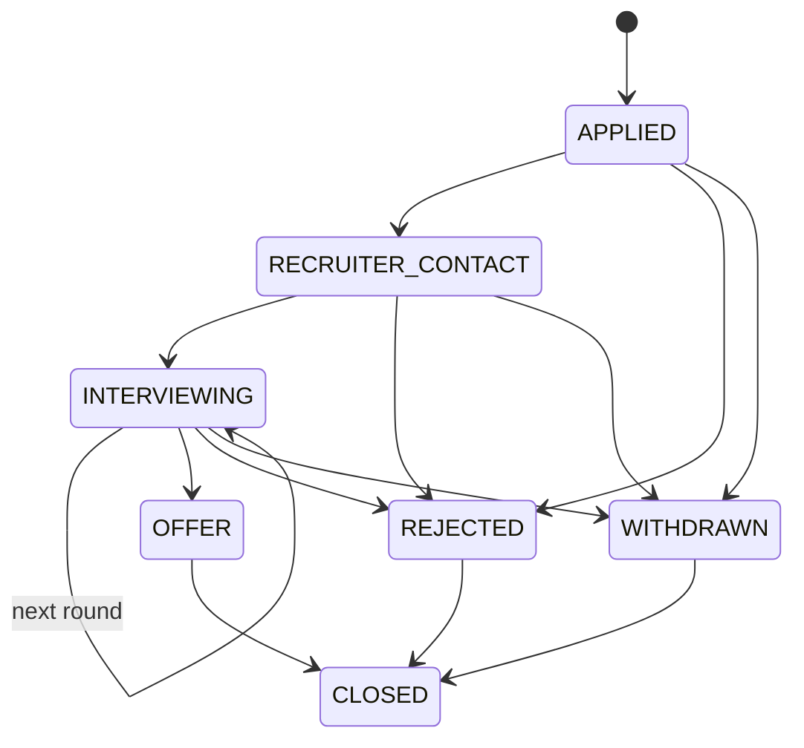

# State Model v0.1

**Status:** ACCEPTED AS SPIKE 1A BASELINE; SPIKE 1B ADDS NO SCHEMA

## 1. Key modeling decision

For MVP:

> **A Job Application is a Project with `project_type = job_application`.**

This keeps the core model small while giving the real-world object a durable lifecycle.

---

## 2. Primary domain objects

### Workspace

```yaml
id: uuid
owner_user_id: string
name: string
created_at: timestamp
```

### Goal

```yaml
id: uuid
workspace_id: uuid
title: string
status: ACTIVE | ACHIEVED | PAUSED | ABANDONED
target_date: timestamp?
created_at: timestamp
updated_at: timestamp
```

### Project

```yaml
id: uuid
workspace_id: uuid
goal_id: uuid?
project_type: string
title: string

status: ACTIVE | PAUSED | CLOSED
lifecycle_state: string
lifecycle_version: integer

metadata: object

created_at: timestamp
updated_at: timestamp
```

Job Application metadata:

```yaml
company: string
role: string
location: string?
application_url: string?
applied_at: timestamp?
current_round: integer?
next_interview_at: timestamp?
interview_type: HM | TECHNICAL | PANEL | OTHER?
```

### Task

```yaml
id: uuid
project_id: uuid
title: string
status: TODO | IN_PROGRESS | BLOCKED | DONE | CANCELLED
priority: LOW | MEDIUM | HIGH | CRITICAL
due_at: timestamp?
created_by: USER | CHATGPT | SYSTEM
source_transition_id: uuid?
created_at: timestamp
updated_at: timestamp
```

### Resource

```yaml
id: uuid
project_id: uuid
resource_type: EMAIL | DOCUMENT | URL | CALENDAR_EVENT | REPO_ITEM | NOTE | OTHER
provider: string?
external_id: string?
external_uri: string?
title: string?
observed_facts: object?
evidence_snapshot: object?
observed_at: timestamp?
created_at: timestamp
```

Default:
**reference + relevant observed facts**, not full source replication.

Spike 1B Gmail observation convention:

```yaml
resource_type: EMAIL
provider: gmail
external_id: <stable individual message ID>
external_uri: <optional Gmail deep link>
title: <minimal or sanitized subject>
observed_at: <message timestamp>
observed_facts:
  contractVersion: gmail-job-observation-v0.1
  sourceFacts:
    receivedAt: timestamp
    senderDomain: string?
    threadId: string?
  interpretation:
    company: string
    role: string
    emailKind: RECRUITER_CONTACT | OTHER
    summary: string
```

This is a payload convention, not a new entity or migration. `sourceFacts`
records source-derived values while `interpretation` records ChatGPT's
work-relevant reading. Do not persist full message bodies, HTML, attachments,
threads, signatures, raw headers, tokens, or unrelated personal data.

The canonical Spike 1B fixture uses `RECRUITER_CONTACT` only and can support
only the approved `APPLIED -> RECRUITER_CONTACT` proof. This convention does
not add a lifecycle edge or schema field.

### Action

```yaml
id: uuid
project_id: uuid
task_id: uuid?
actor_type: USER | CHATGPT | SYSTEM
action_type: string
target_system: string?
status: REQUESTED | RUNNING | SUCCEEDED | FAILED | CANCELLED
idempotency_key: string?
requested_at: timestamp
completed_at: timestamp?
```

### Outcome

```yaml
id: uuid
project_id: uuid
action_id: uuid?
outcome_type: string
summary: string?
evidence_resource_ids: [uuid]
observed_at: timestamp
created_at: timestamp
```

---

## 3. Reliability record: StateTransition

This is a system/audit record rather than another top-level user concept.

```yaml
id: uuid
project_id: uuid
from_state: string
to_state: string
trigger_type: USER_ASSERTION | EXTERNAL_EVIDENCE | ACTION_OUTCOME | IMPORT
evidence_resource_ids: [uuid]

status: PROPOSED | ADMITTED | REJECTED

proposed_by: USER | CHATGPT | SYSTEM
admitted_by: USER | RULE | SYSTEM

idempotency_key: string?

proposed_at: timestamp
admitted_at: timestamp?
rejection_reason: string?
```

Spike 1A persistence adds implementation fields required to enforce the model:

```yaml
from_version: integer
to_version: integer?
canonical_hash: string
admission_authority_type: EXPLICIT_USER_DEV | DETERMINISTIC_RULE?
admission_authority_reference: string?
```

Proposal validation does not grant admission authority. In Spike 1A,
`EXPLICIT_USER_DEV` is the only authority enabled for runtime lifecycle edges.
`SPIKE_FIXTURE_IMPORT` is the sole deterministic rule and only initializes the
seeded Project at `APPLIED`.

Why it is first-class:

Without it:

```text
state = INTERVIEWING
```

With it:

```text
APPLIED
  ↓  because recruiter email X
RECRUITER_CONTACT
  ↓  because interview invitation Y
INTERVIEWING
```

---

## 4. Job Application lifecycle v0.1

Do **not** use `INTERVIEW_PREP` as application state. Preparation is a Task.



### Meanings

- **APPLIED** — application submitted.
- **RECRUITER_CONTACT** — meaningful employer/recruiter progression contact.
- **INTERVIEWING** — interview process active or an interview is scheduled.
- **OFFER** — concrete offer received.
- **REJECTED** — employer explicitly closes/rejects.
- **WITHDRAWN** — user withdraws.
- **CLOSED** — terminal administrative closure.

Interview round is metadata, not a new lifecycle state.

---

## 5. State invariants

1. Every Project belongs to exactly one Workspace.
2. Current Project lifecycle state equals the latest ADMITTED transition.
3. PROPOSED/REJECTED transitions do not mutate durable state.
4. Task status and Project lifecycle are independent.
5. External evidence is not automatically authoritative because an LLM interpreted it.
6. Every externally-derived admitted transition references evidence/provenance.
7. Repeated identical commands/events are idempotent.
8. No critical Project state exists only in chat history.
9. A valid proposal cannot admit itself; admission authority is recorded
   separately.
10. Project lifecycle state and version change atomically with admission and
    any transition-derived Task.
11. Command idempotency keys are mandatory for mutations. Fuzzy or LLM-based
    deduplication is not part of the model.

---

## 6. First derived views

### `workspace.get_project()`

Return:
- project identity,
- lifecycle,
- key metadata,
- open tasks,
- recent resources,
- recent admitted transitions,
- recent outcomes.

### `workspace.get_today()`

Return:
- overdue tasks,
- tasks due soon,
- upcoming dated events,
- recently changed projects,
- blocked/high-priority work.

`Today` is a derived view, not a domain object.

### `workspace.find_job_application(company, role)`

Implemented for Spike 1B. Return exact normalized matches in the current Workspace
with an explicit `EXACT`, `NOT_FOUND`, or `AMBIGUOUS` status. This is a
read-only lookup, not a domain object or generic search infrastructure.
