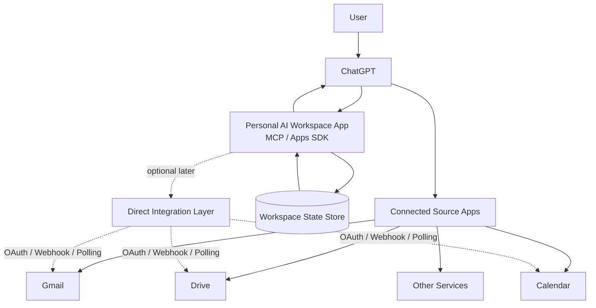

# System Context v0.1

This document includes conceptual ownership as well as the verified Job Search
runtime. Future interfaces and intelligence records below are proposals, not
deployed capabilities.



## Ownership

### ChatGPT
- interaction surface,
- general reasoning,
- cross-app orchestration,
- presentation.

### Connected Source Apps
- source-system access,
- retrieval/actions exposed to ChatGPT.

### Workspace
- Goals,
- Projects,
- Tasks,
- Resource references,
- lifecycle state,
- Actions,
- Outcomes,
- state transition history.

### External Systems
Remain authoritative for their native facts.

Example:

```text
Gmail owns the email.
Calendar owns the event.
Workspace owns the interpretation of how those facts affect the user's work.
```

## Boundary Rule

By default, Resource stores:

```text
provider
external reference
key metadata
observed facts
optional evidence snapshot
```

It does not mirror an entire external system.

## Job Search Intelligence projection boundary

The proposed post-M4 Job Search Intelligence architecture refines this context
without changing current ownership:

- Workspace owns versioned posting/resume relationships, normalized skill
  intelligence, analysis provenance, and reviewable change sets.
- Gmail, Drive, publishing sites, and repositories continue to own their native
  records.
- Google Sheets is a human-facing review and reporting projection, not an
  independent source of truth.
- ChatGPT may extract, compare, explain, and propose. Its confidence does not
  authorize a durable mutation.

See
[`JOB_SEARCH_INTELLIGENCE_ARCHITECTURE_v1.md`](JOB_SEARCH_INTELLIGENCE_ARCHITECTURE_v1.md)
and
[`ADR-012`](../adr/ADR-012-job-search-intelligence-boundary.md).

## Proposed domain secondary interfaces

ChatGPT remains the primary interaction and reasoning host. A domain web UI is
a secondary entry for structured inventory, tasks, evidence and history. It
calls authenticated Workspace APIs backed by the same application services and
database as MCP; it does not own another copy of business state.

Both entries resolve to the same internal Principal and Workspace through their
respective trusted adapters. The existing private MCP tunnel does not provide
browser login or web hosting. Stable object links connect conversation to the
UI; a short object reference lets ChatGPT reread current state on return.

Job Search is the first reference interface. Other domains remain conceptual.
The external ChatGPT job digest is currently a reader of application state;
durable candidate decisions and recommendation history require a separately
gated recording integration. Neither conversation history nor a future UI
cache is authoritative for those records.

See the [secondary-interface proposal](DOMAIN_SECONDARY_INTERFACES_PROPOSAL_v0.1.md)
for the current-state assessment, authentication boundary and implementation
gates. This proposal does not change the active M4 runtime or evaluation scope.
