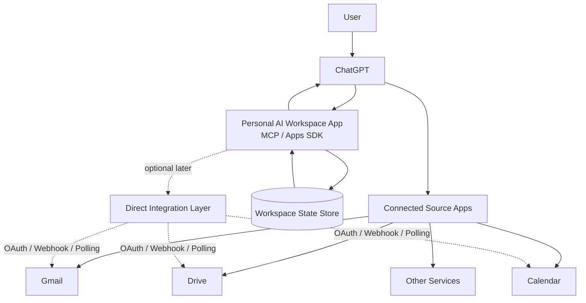

# System Context v0.1



## Ownership

### ChatGPT
- interaction surface,
- general reasoning,
- cross-app orchestration,
- presentation.

### Connected Source Apps
- source-system access,
- retrieval/actions exposed to ChatGPT.

### Workspace
- Goals,
- Projects,
- Tasks,
- Resource references,
- lifecycle state,
- Actions,
- Outcomes,
- state transition history.

### External Systems
Remain authoritative for their native facts.

Example:

```text
Gmail owns the email.
Calendar owns the event.
Workspace owns the interpretation of how those facts affect the user's work.
```

## Boundary Rule

By default, Resource stores:

```text
provider
external reference
key metadata
observed facts
optional evidence snapshot
```

It does not mirror an entire external system.
