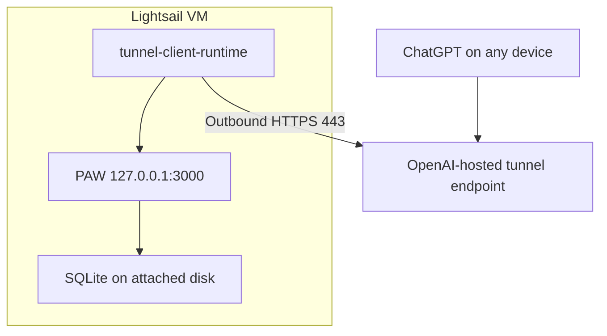

# Cloud Always-On MVP — C2 Secure MCP Tunnel

**Status:** REPOSITORY IMPLEMENTED; CLOUD RUNTIME EVIDENCE PENDING

**Transport:** OpenAI Secure MCP Tunnel

**Public ingress:** None

## Decision

Use the existing OpenAI-hosted tunnel for the single-user MVP. Run the official
`tunnel-client-runtime` on the same Lightsail VM as Personal AI Workspace and
forward requests to `http://127.0.0.1:3000/mcp`.

This deliberately replaces the original public DNS, TLS proxy, and public MCP
endpoint with an outbound-only connection. The application port remains bound
to loopback, so there is no anonymous public mutation surface. The ChatGPT-facing
endpoint, TLS, and Workspace association are owned by OpenAI's tunnel service.

The existing `paw-spike-1a` tunnel was verified in Platform settings on
2026-09-05. It is associated with the Personal Platform organization and a
ChatGPT Workspace. The tunnel identifier and runtime API key must be installed
on the VM, not committed to this repository.



## Security boundary

- No inbound rule is required for the MCP path.
- Do not open ports 80, 443, 3000, or 8080.
- Restrict SSH port 22 to the operator's current public IP where practical.
- `tunnel-client-runtime` may connect outbound to `api.openai.com:443`.
- PAW and tunnel health/admin endpoints remain on host loopback.
- The long-lived runtime key must be a **Restricted** Platform API key with only
  Tunnels **Read** and **Use**. Do not use an Admin key or an unrestricted key.
- The API key is stored in `/etc/paw/secrets/control-plane-api-key`, loaded by
  systemd as a credential, and never placed in argv or Git.
- The service uses a dynamic OS identity, a read-only filesystem view, no Linux
  capabilities, and automatic restart.
- Tunnel transport does not grant Workspace mutation authority. PAW continues
  to enforce its existing observe/propose/admit and explicit-user contracts.

Official behavior and requirements are documented in the
[OpenAI Secure MCP Tunnel guide](https://developers.openai.com/api/docs/guides/secure-mcp-tunnels).

## 1. Create the least-privilege runtime key

In the Platform organization that owns the existing tunnel, create a new
**Restricted** runtime API key. Grant only:

- Tunnels: Read
- Tunnels: Use

Do not grant Tunnels Manage. Copy the key once into a password manager, then
install it directly on the VM. Never paste it into an issue, PR, commit, chat,
shell command, or shell history.

## 2. Install the pinned official runtime

The installer pins the official OpenAI `v0.0.14` runtime release and validates
the platform-specific archive against the SHA-256 digest published with that
release. It supports Linux `amd64` and `arm64` and fails closed otherwise.

The VM needs `curl`, `unzip`, and `sha256sum`:

```bash
cd /opt/paw
sudo ./deploy/cloud/install-tunnel-client.sh
/usr/local/bin/tunnel-client-runtime --version
```

Upgrading the runtime is a reviewed deployment change: update both the pinned
version and digest, review the release notes, run repository verification, and
roll it out through a separate commit. Do not silently track `latest`.

## 3. Install non-secret configuration

```bash
sudo cp deploy/cloud/tunnel-client.env.example /etc/paw/tunnel-client.env
sudo chown root:root /etc/paw/tunnel-client.env
sudo chmod 0640 /etc/paw/tunnel-client.env
sudoedit /etc/paw/tunnel-client.env
```

Replace only `CONTROL_PLANE_TUNNEL_ID` with the existing tunnel ID. Keep:

```dotenv
MCP_SERVER_URL=http://127.0.0.1:3000/mcp
MCP_STARTUP_WAIT_TIMEOUT=60s
HEALTH_LISTEN_ADDR=127.0.0.1:8080
```

## 4. Install the runtime API key

Create the secret file without exposing the value in shell history:

```bash
sudo install -d -o root -g root -m 0700 /etc/paw/secrets
sudoedit /etc/paw/secrets/control-plane-api-key
sudo chown root:root /etc/paw/secrets/control-plane-api-key
sudo chmod 0600 /etc/paw/secrets/control-plane-api-key
```

The file must contain only the runtime API key and an optional final newline.
The systemd unit passes a protected credential-file reference to the client.

## 5. Enable the tunnel service

Start PAW first and prove its loopback health endpoint succeeds. Then install
and start the tunnel unit:

```bash
cd /opt/paw
./deploy/cloud/health.sh
sudo cp deploy/cloud/systemd/paw-tunnel-client.service /etc/systemd/system/
sudo systemctl daemon-reload
sudo systemctl enable --now paw-tunnel-client.service
./deploy/cloud/tunnel-health.sh
```

`/healthz` proves the process is live. `/readyz` is the acceptance signal for
control-plane polling plus MCP reachability. Inspect privacy-bounded logs if it
is not ready:

```bash
sudo systemctl status paw-tunnel-client.service --no-pager
sudo journalctl -u paw-tunnel-client.service --since "15 minutes ago" --no-pager
```

Do not enable raw HTTP logging or debug payload logging against real job-search
data.

## 6. Validate the network boundary

On the VM:

```bash
ss -ltn
curl --fail http://127.0.0.1:3000/healthz
curl --fail http://127.0.0.1:8080/readyz
```

Expected listeners are loopback-only for ports 3000 and 8080. From outside the
VM, ports 80, 443, 3000, and 8080 must be unreachable. SQLite must exist only as
a file under the mounted `/srv/paw/data` path.

## 7. Connect and validate from ChatGPT

The existing ChatGPT development app can continue selecting the same tunnel;
the app does not need the VM's IP address or a new public URL. Keep the tunnel
runtime healthy while testing.

In a new ChatGPT conversation:

1. Enable or select the Personal AI Workspace development app if it is not
   already available to the conversation.
2. Ask naturally whether the Workspace is available, or explicitly request
   `workspace_ping` for the controlled acceptance test.
3. Verify the returned Workspace ID and service version against the local
   loopback call.
4. Run the frozen read-only M3 checks before any mutation.

Natural language does not need to mention `@Personal AI Workspace` every time;
tool selection depends on the app being available to that ChatGPT context.
Explicit naming remains useful during acceptance because it proves which system
answered.

## C2 acceptance evidence

- [x] Existing tunnel is visible to the intended Personal organization and
  ChatGPT Workspace
- [ ] Restricted runtime key has only Tunnels Read + Use
- [ ] Pinned official runtime archive checksum succeeds
- [ ] PAW `/healthz` succeeds on loopback
- [ ] tunnel-client `/healthz` and `/readyz` succeed on loopback
- [ ] Invalid or missing runtime authentication fails closed
- [ ] No public listener exists on ports 80, 443, 3000, or 8080
- [ ] Valid ChatGPT connection calls `workspace_ping`
- [ ] Container restart returns PAW and tunnel connectivity
- [ ] EC2/Lightsail reboot returns PAW and tunnel connectivity automatically

C2 is not complete until these checks are executed against the actual VM. Do
not migrate the authoritative real database before C1 and C2 runtime acceptance.
