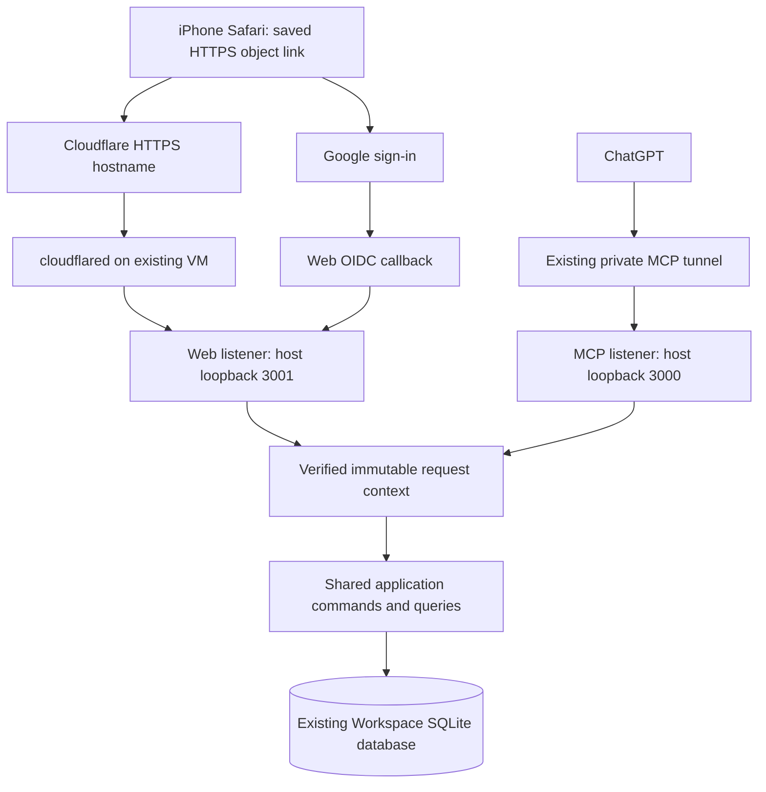

# Job Search Secondary Interface — P0 Technical Plan v0.1

**Date:** 2026-09-05 (Australia/Sydney).

**Status:** Design baseline. The subsequent
[local S1 scope decision](S1_LOCAL_SCOPE_DECISION_2026-09-05.md) authorized local
implementation; [S1-01](S1_01_IDENTITY_RESULTS_v0.1.md) has passed synthetic
verification, followed by [S1-02 query/readback verification](S1_02_QUERY_RESULTS_v0.1.md).
The subsequent [S1-03 page verification](S1_03_WEB_RESULTS_v0.1.md) includes local
responsive views and synthetic browser checks.
Public authentication acceptance and deployment remain pending.

**Authority:** The user requested P0 technical planning after reviewing the
two-stage delivery recommendation. This authorizes this design and its linked
scope clarification. It does not itself lift the M4 runtime freeze, accept this
new authentication design under ADR-007, or authorize external provisioning.
The later local S1 authorization is recorded above and takes precedence over
the original planning-only boundary for that bounded local work.

## 1. Delivery decision

The first operational release lets the user open a saved link on iPhone, inspect
existing applications and Today, complete a task, and recover the exact completed
record in a fresh ChatGPT conversation. Both entries use the existing Workspace.

| Release | Included | Completion criterion |
| --- | --- | --- |
| S1a — read preview | Independent login, Today, active/closed application inventory, application detail, open and terminal tasks, bounded evidence/history, direct links and context copy | Authenticated mobile reads and truthful coverage pass; this remains an intermediate preview. |
| S1 — operational first stage | S1a plus explicit completion of one existing open task, durable actor audit, exact terminal-task MCP readback, retry/conflict handling | All S1 gates in section 8 pass, including Windows-off use and both directions of cross-entry verification. |
| S2 — recommendation continuity | Candidate records, save/dismiss/restore, run/item history and coverage, actual-application registration/linking, scoped digest recording | Original candidate scenarios and complete A01–A12 acceptance pass. |

S1 has Today, Applications and application/task detail. Jobs navigation arrives
with S2. S1 exposes only task completion as a browser business mutation. New task
creation, priority/due-date changes and other existing commands remain available
through ChatGPT; extending their browser controls is later work. No visual
lifecycle admission editor is needed for S1 or candidate registration in S2.

S1 is a usable first stage, not the complete product increment promised by the
[requirements](JOB_SEARCH_SECONDARY_INTERFACE_REQUIREMENTS_v0.1.md). The P0–P6
package IDs remain stable: deliver P0 → P1 → P2 → the completion subset of P4 for
S1, then P3/P5 and the full P6 gate for S2. P3 is not a dependency of S1 completion.

## 2. Recommended topology and technology

Reuse the accepted Lightsail instance, attached disk, Node/TypeScript application
and SQLite database. Add a separate Express web listener in the same application
process, with server-rendered HTML, CSS and small TypeScript browser modules.
No additional frontend server is needed. Escape all rendered source/user text;
never render evidence as trusted HTML. This implementation choice is a proposal,
not a dependency already installed.

Recommend a named Cloudflare Tunnel for the browser hostname, and Google OIDC
authorization-code login handled by the application. Cloudflare publishes the
HTTPS route; it does not grant application identity. Cloudflare Access is not a
second required login system. A named tunnel requires a Cloudflare account and a
domain on Cloudflare; its outbound connectivity requires port 7844. These are
deployment prerequisites, not verified properties of the user's accounts.
[Cloudflare setup](https://developers.cloudflare.com/tunnel/setup/).

Proposed origin: `https://workspace.<user-controlled-domain>`. This is a
placeholder, not a registered or working address. Use a dedicated hostname and
an exact route to the web listener, plus a catch-all rejection rule. Keep host
ports 3000, 3001 and tunnel health private; no new public VM inbound port is
needed. The web app must have no MCP route or generic proxy to the MCP listener.
Do not attach the existing MCP Express app beneath a public web router.

Cloudflare becomes a processor on the browser HTTP path; the design assumes TLS
termination at its edge. Treat browser payloads as traversing that service, not
as an end-to-end encrypted channel visible only to the VM. Google handles login;
job descriptions, task content and object return paths are not sent as login
parameters. The existing private MCP path remains independently configured.

Only same-origin static assets are used. Apply a restrictive CSP, frame
protection and `Referrer-Policy: no-referrer`; set authenticated HTML/API responses
to `Cache-Control: private, no-store` and configure CDN cache bypass for them.
Use a fixed configured origin for links and redirects. Do not infer it from
untrusted Host or forwarded headers. Trust only the explicitly configured proxy
hop for protocol/client-address handling, and validate the expected host.

## 3. Login and association with the existing identity

The current [startup](../../src/server.ts) calls `ensureDevelopmentIdentity` and
constructs [WorkspaceService](../../src/application/workspace-service.ts) around
one configured development identity. Passing a browser identity into that
initializer could create a second empty Workspace. Browser requests must instead
resolve an existing association and fail closed if it is missing.

### Login flow

1. A signed-out object request stores a validated local return route in a short
   server-side login transaction. Only known Workspace paths are accepted; reject
   absolute URLs, protocol-relative URLs and malformed encoded paths.
2. Start Google authorization-code login with state, nonce and PKCE S256. Keep
   the verifier and return route server-side. Request only `openid email` for
   login, without offline access or Gmail/Drive scopes.
3. Use a maintained OIDC library to exchange the code and validate signature,
   issuer, audience, expiry, nonce and transaction binding. Reject replay and
   cancel/timeout without creating a business identity. Register exactly
   `/auth/google/callback` on the chosen HTTPS origin.
4. Resolve the verified issuer/subject through the explicit association below.
   Email is a display/bootstrap check, never the durable account-linking key.
5. Rotate the session identifier and redirect to the saved route. Subsequent
   object reads still enforce ownership.

Google documents server-side code exchange and stable subject-based identity.
[Google OIDC](https://developers.google.com/identity/openid-connect/openid-connect).
The proposed client library is `openid-client`; its maintainers document code
flow and PKCE support. Pin a tested version in the implementation lockfile.
[Library source](https://github.com/panva/openid-client).

### Explicit association and bootstrap

Add an additive `principal_identity_links` table with unique `(issuer, subject)`,
`principal_id` foreign key, `created_at`, `linked_by_principal_id` and
`revoked_at`. Preserve the existing `principals.issuer/subject` and Workspace
ownership unchanged. Resolve the workspace through its existing owner foreign
key; accept no principal/workspace ID supplied by the browser as authority.

The first association is an operator procedure, never “first login becomes
owner.” With business web access disabled, allow a verified login to produce a
short-lived pending identity record, without a Workspace session or data access.
The operator compares the verified account to the user's chosen account and
links that exact pending issuer/subject to the privately verified existing
principal using a local administration command. Link and operator audit commit
atomically. The pending reference expires after ten minutes, is single-use,
and contains no reusable login credential. A login must be repeated after linking.
Other identities remain denied; email equality never auto-links them.

Store real identifiers, pending records and secrets outside Git/OneDrive. No
web endpoint may create, replace or revoke an identity link. Revocation through
administration disables that link and its sessions. Each authenticated request
checks that the link and Workspace ownership are still valid. Recovery from a
lost Google account uses the same operator procedure; it does not reassign records.

### Sessions and action authority

Use a random opaque `__Host-paw_session` cookie with Secure, HttpOnly, Path=/,
SameSite=Lax and no Domain. Proposed policy: 12-hour inactivity timeout and
seven-day absolute lifetime; logout and link revocation invalidate immediately.
Keep hashed session IDs and expiry metadata in an ephemeral server-side store;
a process restart requires login again. Store neither Google access/ID tokens
nor business records in browser persistent storage. Login transactions last ten
minutes and are deleted on use/expiry. These durations are product choices.
[OWASP session guidance](https://cheatsheetseries.owasp.org/cheatsheets/Session_Management_Cheat_Sheet.html).

Require a session-bound CSRF token and exact Origin check on business writes and
logout. GET business queries never mutate business state. Rate-limit login and
callback requests; bound pending transactions and session counts. A browser body
cannot set actor, channel, principal, workspace or an `EXPLICIT_USER_DEV` grant.
[OWASP CSRF guidance](https://cheatsheetseries.owasp.org/cheatsheets/Cross-Site_Request_Forgery_Prevention_Cheat_Sheet.html).

The verified adapter builds an immutable context containing principal ID,
Workspace ID, channel (`WEB` or `MCP`) and request ID. Refactor the application
identity seam to consume that context without changing identity on a singleton.
Both read queries and commands must use it. Keep a compatibility adapter for the
existing private MCP development identity and its published command inputs.

## 4. First-stage read and completion contracts

The following are the design contracts. S1-01 implemented the session surface;
S1-02 implemented the read routes and exact-task MCP tool. Their linked results
define current local behavior. The completion route remains unimplemented.

| Surface | Result / behavior |
| --- | --- |
| `GET /api/v1/session` | Minimal authenticated session state and CSRF token; no provider tokens. |
| `GET /api/v1/job-search/today` | Existing deterministic date/timezone, attention reasons, upcoming and separate task gaps; successful read timestamp. |
| `GET /api/v1/job-search/applications` | Active/closed/lifecycle filters, company/role search, deterministic sorting, bounded pages, total and task summaries without per-row detail requests. |
| `GET /api/v1/job-search/applications/{id}` | Current authorized application, record/lifecycle versions and separately labeled source observations. |
| `GET /api/v1/job-search/applications/{id}/tasks` | Status-filtered open/DONE/CANCELLED records with bounded coverage. |
| `GET /api/v1/job-search/applications/{id}/history` | Paged actual admitted lifecycle events; proposals separately labeled; no invented intermediate stages or historical task edits. |
| `GET /api/v1/job-search/applications/{id}/resources` | Paged minimized evidence references/observations; provider access remains separate. |
| `GET /api/v1/job-search/tasks/{id}` | Exact authorized task, including terminal state, completion time and version. |
| `POST /api/v1/job-search/tasks/{id}/complete` | Expected record version plus intent key; server-authorized invocation of shared update logic with status DONE. |
| Proposed MCP `workspace_get_task({taskId})` | Same exact read projection, read-only, including terminal tasks. Existing 12 tools keep their input/output behavior. |

Use 25-row defaults and a 100-row maximum for paged web collections. Every page
returns items, matching total, next cursor, as-of time and coverage. Bind cursors
to workspace, filter and sort; reject malformed or mismatched cursors. Always add
ID as a sort tie-breaker. For mutable inventory/task sorting, include a revision
fingerprint of the matching result in the cursor, computed within the same read
transaction as the page. A changed result invalidates continuation and asks the
UI to reload; it must not silently skip/repeat rows. Benchmark this bounded-query
approach before substituting a persisted revision mechanism. Default inventory
order is updated time descending, then ID ascending. Task summary “next due” is
the earliest dated open task; an undated task is not given an inferred deadline.

The current `TaskService.getTask` is private; `workspace_get_project` returns
only open tasks. The new exact query must verify the parent is an owned Job
Application, including closed parents. A missing or wrong-owner object produces
the same NOT_FOUND response. Frozen list/history caps must not truncate the new
web queries silently. Empty successful results differ from denied/failed reads.

### Completion, audit and retry

The Complete action identifies the task and expected version. It is sufficient
user intent without a second routine confirmation dialog. The adapter creates a
trusted internal `EXPLICIT_USER_WEB` action record; the shared task command accepts
this validated context through an internal interface. It must not manufacture a
development-authority object from a client `confirmed` flag. Existing lifecycle
admission authority is outside this change.

Reuse the existing task update transaction, terminal checks, version increment
and `completedAt`. Keep `workspace_update_task` as the canonical operation name
for both adapters. Preserve the existing MCP payload hashing/replay format.
For web calls, derive a stable authority reference from the original intent and
actor, not the changing request/session ID. Same intent and payload replay once;
changed payload conflicts. Reauthenticate/recheck ownership before serving a replay.
Do not promise that two independent user clicks in different entries share an
intent key; version checks resolve those competing commands.

Add `task_command_audit` with Workspace/principal/target IDs, operation, channel,
intent key, authority type/reference, before/after versions and changed fields,
outcome and timestamp. A uniqueness constraint covers Workspace/operation/intent.
New successful task commands through either adapter write audit in the same
transaction as task state and idempotency response. Roll back all three if audit
fails. No-op success records equal versions; exact retries add no audit. Existing
idempotency records replay without fabricated retrospective audit. Historical
actor categories stay intact; label the date from which detailed audit exists.

Return structured 401/403, non-enumerating 404, 409 version/intent conflict,
422 invalid action and 503 temporary-unavailable outcomes. A timed-out response
is uncertain: preserve the original intent and resolve by same-key retry or fresh
read. Show success only after acknowledgment or authoritative confirmation.
On conflict, show fresh state and let the user choose a new intent. Never reopen
DONE/CANCELLED. Completing a task does not advance application lifecycle.

## 5. Mobile behavior and ChatGPT handoff

Stable routes are `/workspace/job-search/today`, `/applications/{projectId}`
and `/tasks/{taskId}`, with the latter two under the same Job Search prefix.
An authorized saved link works in Safari without ChatGPT or Windows. Add-to-home-
screen is optional bookmarking; no native app or offline business database.

Use portrait cards/rows with role/company, admitted state, next task and due time.
Keep evidence/history below the primary work. Show last successful read and source
observation times distinctly. Refresh when returning to the foreground; retain
in-memory draft/intent state and detect newer versions. On network failure mark
loaded content stale and disable writes. No service-worker cache of private data,
automatic offline queue, hover-only actions or horizontal core-flow table scroll.

After completion, show DONE, completion time and the current version in detail
and Completed tasks. “Copy context for ChatGPT” includes only a short question
and the exact object ID, then asks for fresh Workspace readback. Provide selectable
text if clipboard access fails. The user pastes/submits it in a new conversation;
automatic conversation injection is not required. The additional read-only MCP
tool is a necessary S1 contract expansion, not something the frozen app has today.

## 6. Storage, deployment, costs and rollback

Only identity linking and task audit require additive business-database migration
in S1; candidate/run tables belong to S2. Sessions and pending logins are ephemeral.
Inventory paging may add indexes after query measurement. Do not rebuild existing
tables or rewrite source rows for identity linking. Backup/restore must include
the additive tables, with minimized private evidence retained outside Git.

Build assets in the image build stage. Run one application/database process with
two listeners and separate route trees; retain the existing non-root/container
hardening. Bind the new host port to loopback explicitly. Run `cloudflared` as a
separately managed, pinned service with an isolated credential and automatic
restart. Define `PAW_WEB_ENABLED` and `PAW_WEB_WRITES_ENABLED`, both off by default.
Missing web identity/origin configuration fails the web surface closed.

| Cost item | Planning treatment |
| --- | --- |
| Existing VM + disk | Historical accepted baseline USD 7.80/month, before snapshots/tax/overages; not a refreshed quote. |
| Incremental runtime | Reuse the existing VM; no second VM, managed database or frontend hosting subscription in this design. Capacity still needs measurement. |
| Domain | Reuse an owned suitable domain if available. Ownership and renewal price are unknown; no purchase is authorized. |
| Tunnel / login services | Aim for no added subscription. Account eligibility and actual plan charges are unverified; do not present this as a zero-cost deployment. |
| Budget gate | Reconcile current recurring charges, snapshots and annualized domain cost against the existing USD 10/month baseline before provisioning; record any exception separately. |

The public [Cloudflare pricing page](https://www.cloudflare.com/plans/zero-trust-services/)
was checked on 2026-09-05 but did not supply a usable account-specific quote.
Do not infer plan eligibility from an older free-tier description. The recorded
C1 VM idle sample is not web capacity evidence: test concurrent reads, login and
completion alongside backup and MCP, checking memory, OOM/restarts and latency.

Release sequence after scope/auth acceptance: synthetic local implementation and
regression → isolated synthetic HTTPS login/read preview → migration/rollback
rehearsal on an external database copy → reviewed real deployment with writes off
→ verify existing identity/inventory and backup → enable completion → S1 mobile
and cross-entry acceptance. No real-data mutation is authorized by this plan.

First rollback action is to disable browser writes/access and stop its tunnel;
keep MCP available and preserve all committed work. Retain the new tables and
restore the previous accepted image only after old-image/new-schema compatibility
and old idempotency replay have passed on an isolated copy. Do not apply down
migrations or overwrite the database to undo a UI release. If compatibility fails,
keep the new binary with web disabled while preparing a fix. An old binary may
not produce the new detailed audit: record the coverage interruption explicitly.
Any necessary database restore is a separate incident procedure with intervening
business writes reconciled, never an automatic application rollback step.

## 7. Bounded implementation packages

This is the original package responsibility map, not a delegation record.
S1-01 through S1-03 implementation evidence is linked above; S1-04 remains next.

| Package | Intended ownership / work | Exit evidence |
| --- | --- | --- |
| S1-01 identity | Application identity seam, new `src/auth/` resolver/login/session code, additive identity-link migration and operator bootstrap script | Correct existing Workspace; wrong identity/owner denied; MCP identity behavior retained. |
| S1-02 reads | New application query module, terminal-task read, `src/mcp/create-server.ts` additive tool, bounded queries/indexes | Closed/terminal retrieval, >100 applications, >10 history records, cursor invalidation and ownership cases. |
| S1-03 web preview | New `src/web/` adapter/templates/assets, config/startup and image asset packaging | S1a mobile/direct-link/freshness/accessibility checks; public web route cannot reach MCP. |
| S1-04 completion | Internal trusted task authority seam, task audit migration, completion adapter and UI | Atomic state/audit/idempotency, unchanged legacy replay, stale-version rejection and uncertain-response recovery. |
| S1-05 operations | New web-tunnel service/config, compose loopback mapping, rollout/rollback runbook | Synthetic external auth acceptance, capacity, restart/backup, then reviewed real S1 end-to-end acceptance. |

Do not edit existing accepted migration files to implement new storage. Assign
new migration numbers when implementation starts. The new exact-task MCP tool
changes discovery from 12 to 13; update discovery expectations explicitly while
preserving historical 12-tool acceptance records and existing command behavior.

## 8. S1 acceptance and relationship to original scenarios

These full release gates have **not passed**. Local S1-01 through S1-03 results
above provide partial synthetic evidence for identity, transport, reads, Today
and handoff/accessibility; real Google/Safari/iPhone and completion gates remain
pending. Existing C4/C5 evidence is groundwork, not a pass for the new web
interface. Use synthetic data in Git-tracked fixtures.

| Gate | Required demonstration | Original coverage |
| --- | --- | --- |
| G01 identity | Signed-out saved link → login → same existing Workspace/object; unmapped/wrong account, forged token, replayed callback, expired/revoked session and guessed child ID denied | A01 |
| G02 transport | HTTPS on Safari; no public MCP/health/DB access; rejected CSRF/origin/return-path/host forgery and untrusted text safely rendered | A01/A09 security prerequisites |
| G03 complete reads | >100 applications, >10 resources/transitions, stable continuation or explicit invalidation, accurate totals and terminal-task retrieval | A02, A04; read part of A06 |
| G04 Today/freshness | Existing reason sets and counts agree with MCP; task gap remains separate; foreground refresh preserves drafts and reports stale state | A03, A05 |
| G05 completion | UI completes a synthetic task; reload and fresh ChatGPT `workspace_get_task` agree on task ID, parent, DONE, timestamp and version | A06, A09 |
| G06 reverse continuity | Explicit ChatGPT task update/creation appears after UI refresh; an older completion draft cannot overwrite it | A03, A09 |
| G07 failure/audit | Lost response, double submit, changed intent, session expiry and forced audit failure preserve transaction/retry rules; legacy keys still replay | A09 |
| G08 device/recovery | User attests Windows off; iPhone direct open/filter/complete and independent conversation readback pass; service restart, backup and rollback rehearsal pass | S1 subset of A10 |
| G09 handoff/accessibility | Exact context copy and selectable fallback; portrait 390px plus narrow 320px layout, labeled keyboard controls, visible focus, no hover-only core action | A12; S1 subset of A10 |

A07/A08/A11 and candidate save/dismiss portions of A10 belong to S2 and remain
pending after S1. S1 does not claim complete R08 browser editing coverage or the
full recommendation-to-application journey. Record actual user effort/friction
after functional acceptance without changing M4 metrics or counting scripted
acceptance as real-use success.

## 9. Review result and deployment bindings

This plan resolves the recommended topology, association mechanism, session and
authority boundary, stage scope, storage delta, rollback approach and acceptance
packages. It remains a proposed design under
[ADR-007](../adr/ADR-007-identity-auth-boundary.md), not evidence of authentication
approval or a deployed endpoint.

Before external setup, bind the actual domain/hostname, Cloudflare account/plan,
Google OAuth project/client and chosen login identity through private operational
configuration. Confirm current costs and accept the new browser-path processor.
No secrets are needed in chat or Git. The subsequent local S1 scope revision
permits implementation and synthetic testing now. The deployed M4 freeze and
external setup/publication review remain in force; local authorization is not
production release authorization.

**Validation performed for this document:** inspected application identity/task
logic, MCP read surface, migrations and accepted deployment evidence; checked
the official sources linked above. Link and whitespace validation is recorded
with the documentation change. This describes the original design validation;
subsequent local implementation evidence is in the linked S1-01 results.
