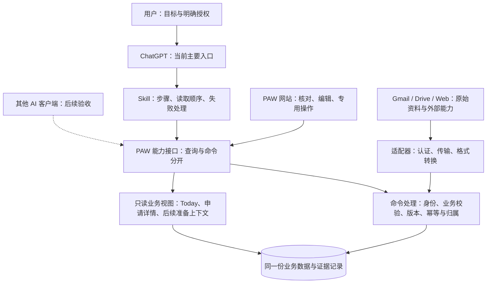

# PAW 整体方案与项目路线图

更新：2026-09-11。状态：当前规划依据；各阶段的实现和验收状态分别记录。
本次依据用户对 Amazon Quick 架构评审的反馈调整方案，不代表部署、数据写入或平台接入已经完成。

## Continuity and benefits

- **上游需求：** 延续[核心求职流程](../architecture/CORE_JOB_WORKFLOW.md)、已验收的[简历编辑器](../architecture/RESUME_EDITOR.md)，以及用户优先开发[职位简历副本](../architecture/RESUME_VARIANTS.md)的选择。用户要求结合本轮架构评审更新整体方案及 roadmap。
- **本次交付：** 统一产品定位、职责分配、阶段顺序和退出条件；调整规划，不实现通用 Space、调度器或多 Agent 框架。
- **下游：** 先完成职位简历上线及真实数据验收，再补齐 Agent 的只读资料访问，最终支持有来源的岗位分析和面试准备。
- **近期价值：** 当前已交付、待验收与待开发能力有统一索引；减少重复查询和选错简历是后续阶段需要验证的收益。
- **长期价值：** 让不同会话、将来的第二个客户端共享一致的业务记录；可替换性必须经实测证明，不把平台能力增长视为 PAW 价值自然增长的保证。

## 1. 产品定位

面向用户：**让 AI 接着真实的求职进度工作，找到正确资料，给出有依据的下一步。**

架构定位：**The system of record behind your AI agents.**

当前首先服务 Job Search，主要交互入口仍是 ChatGPT；网站保留状态核对、简历编辑、资料选择及已授权的专用操作。多平台一致性是待验收目标，尚未承诺所有 Agent 均可直接接入。

PAW 保存有来源、可追溯、经相应规则接受的业务状态。它不替代 Gmail 对原始邮件、Drive 对原始文件的权威，也不保证所有保存的解释都是真实结论。模型推断、来源事实和用户确认必须可区分。

## 2. 整体 solution

图中外部资料是可选获取路径，不要求所有外部读取都代理到 PAW。平台连接器可直接读取来源，再通过 PAW 命令保存有归属的证据。

| 责任方 | 负责什么 | 边界 |
| --- | --- | --- |
| 用户 | 目标、取舍、明确授权 | 推断、建议或过去无关批准不能替代当前操作所需授权 |
| 平台 | 对话、推理、通用执行、调用权限与可用的调度能力 | 平台允许调用不等于业务操作被 PAW 接受 |
| Skill | 可重复步骤、读取和验证顺序、失败处理、输出纪律 | 不保存业务状态，不复制生命周期判定，不自行授予权限 |
| PAW | 领域对象、证据归属、状态变更校验、版本、幂等、查询与审计 | 不声称拥有所有外部事实或能够绕过平台权限 |
| 集成适配器 | 外部认证、API 翻译、读取/动作能力、外部错误 | 业务判定复用领域服务；来源内容不能变成执行指令 |

平台调用许可、用户授权、PAW 业务校验是三个独立条件。查询返回的操作提示仅描述所需前提，执行时必须重新验证。

## 3. 保留、简化及不建设的内容

**保留：** 领域数据和证据记录、生命周期与 Tasks、扫描回执、当前网站、简历模板和导出、资料库、报告与人类决定历史。

**逐步简化：** 后续修改 Gmail 时，把业务流程协调与外部 API 适配分清；复用现有 Today/申请查询，避免网站与 MCP 各自拼出不同的业务结论。内存缓存只有在影响恢复或结果判断时才需要调整，不一律持久化。

**当前不建设：** 通用聊天 UI、通用 Agent runtime、工作流引擎、自建通用调度器、Space 数据库、连接器市场、仪表盘或应用搭建器。

本轮延续[平台所有权检查](OPENAI_PLATFORM_WATCH.md#ownership-check)：持久化求职关联与业务校验属于当前已验证需求；通用交互与执行优先使用已有平台能力。如果平台以后能够可靠保留对象 ID、来源、版本和显式授权边界，并通过 PAW 场景验收，再评估替换相关实现。无需因产品分类相似而立即迁移。

## 4. 当前基线

以下为仓库已有验收记录，不代表本次又进行了生产检查。

| 能力 | 当前状态 | 证据 |
| --- | --- | --- |
| 应用状态、任务、证据、Today/Jobs | 已有生产基础与历史验收 | [核心流程](../architecture/CORE_JOB_WORKFLOW.md)、[UI 验收](../mvp/TODAY_AND_JOBS_2026-09-10.md) |
| 基础简历、排序、预览、导出、区域导航 | 已上线并获用户验收 | [简历编辑器](../architecture/RESUME_EDITOR.md) |
| 独立职位简历 | 已上线；migration 018、真实 Nuix 工作稿保存/重开/导出通过，基础版保留 | [副本契约及发布记录](../architecture/RESUME_VARIANTS.md) |
| 单申请准备上下文 | 已部署；真实 Nuix v3 读取与有边界的准备示例通过，完整资料及连接器显式选择待验收 | [读取契约](../architecture/APPLICATION_PREPARATION_CONTEXT.md) |
| 申请资料与 Drive 简历关联 | 已有存储、页面及读取；资料完整性仍需逐申请确认 | [申请资料流程](../architecture/APPLICATION_DOSSIER_WORKFLOW.md) |
| Job Tracker | 已有手动扫描证据；实际无人值守成功回执仍待验收 | [每日验收](../mvp/DAILY_WORKFLOW_ACCEPTANCE.md) |
| Platform Watch | 报告页面与三份报告已交付；周任务规则已同步；修订后的定时质量与实际人类决定仍待验证 | [Watch](OPENAI_PLATFORM_WATCH.md)、[报告契约](../architecture/PLATFORM_WATCH_REPORT_DECISIONS.md) |
| 外部职位模型匹配 | 保持关闭；不因本 roadmap 自动开启 | [资料库当前选择](../architecture/JOB_LIBRARY_WORKFLOW.md#current-operating-choice) |

## 5. Project roadmap

按依赖与验收推进，不设没有估算依据的日历承诺。开发顺序为 R1 → R2 → R3；运维验收 O1 和 Watch 评估 O2 独立跟进，不把等待定时触发变成全部开发的阻塞。

| 阶段 | 优先级 / 状态 | 用户可见结果 | 完成条件 |
| --- | --- | --- | --- |
| R1 职位简历交付 | P0；已上线并完成真实副本操作验收 | 每个职位有独立可编辑简历，基础版与副本互不影响 | 已通过备份恢复、018 迁移和发布检查；真实副本保存、重开、预览及 Word/PDF 导出；基础内容保留，PDF 空白尾页已修正 |
| O1 每日同步可信运行 | P0；待实际运行验收 | 今天能看到真实更新、完整覆盖或明确失败提示 | 真实定时触发与对应持久回执匹配；按实际结果核对覆盖和发生的写入，无更新时不制造写入 |
| R2 单申请准备上下文 | P1；已部署，真实读取部分验收通过 | GPT 获取某个申请的 JD、状态、任务和明确选择的工作简历，不必反复找资料 | 已记录真实单次读取、版本与缺失项；完整保存资料场景及刷新后连接器显式选择仍待验收 |
| R3 有依据的岗位与面试准备 | P1；候选评级存储/接口及 Jobs 展示已部署，登录后列表/详情验收通过，真实评级验收待完成；面试准备仍待开发 | 比较岗位要求与真实经历，准备引用相关项目的面试材料 | 一份准备结果可追溯到 JD、简历版本与经历来源；建议与事实分开，用户纠正可保留，资料缺失不被伪造成能力不足 |
| O2 Watch 支持实际决策 | P1；已有报告能力，待持续验收 | 用户看到具体保留/改变建议和后续结果 | 审阅真实周报告、记录用户实际选择，再跟踪有证据的结果；报告建议不自动修改路线图或代码 |
| R4 第二客户端与维护简化 | P2；待验证 | 在选定的第二客户端读取同一申请得到一致业务状态 | 对同一数据版本核对 ID/来源/状态、权限与错误；不要求自然语言答案逐字一致；按遇到的实际问题整理适配器 |

### 待办：职位 JD 匹配评级（R3，2026-09-11）

September 12 follow-up: Jun supplied recoverable pre-screening rules before letter
grading. [Recoverable screening](../architecture/JOB_SCREENING.md) is locally
implemented with immutable history, shared list filtering and explicit recovery
(490 tests, both type checks/build, additive migration and browser checks passed).
It distinguishes mandatory/preferred requirements, career categories, confirmed
shortfalls and unknown evidence. Migration 020 is deployed as
`job-screening-20260912-r1`; production-copy recovery, data preservation and
authenticated Web/MCP reads passed. Subsequent real-client evidence follows;
existing candidate decisions and assessment acceptance remain separate.

Real-client testing then exposed the missing confirmed-profile admission command.
`screening-profile-20260912-r1` repairs it through the existing source library:
35 tools, 496 passing tests, production-copy recovery and actual server readback.
Jun's September 12 [ChatGPT readback feedback](../architecture/JOB_SCREENING.md#real-client-acceptance-and-jd-ingestion-gap--september-12)
confirms profile v1 / CONFIRMED and Google screening v1 / USER_CONFIRMATION_REQUIRED
(5-year tenure UNKNOWN, not FILTER), preserving candidate v2 / DISMISSED. This is
user-supplied real-use evidence, not a new Codex production probe.

Next screening increment: expose controlled candidate JD ingestion with attributable
full text, version/idempotency checks and fresh assessment-context readback. Exact
API design remains pending. Nine other candidates report MISSING_JD, so real
8+/10+ FILTER → explicit KEEP → visible-again acceptance is still blocked. The
user-reported Accenture Sydney Tech Lead JD is a proposed 10+ commercial SWE target;
its text must first be saved and read back with a real jdHash. Do not infer a saved
JD from candidate metadata or treat this documentation update as implementation.

Subsequent [JD admission implementation](../architecture/JOB_SCREENING.md#candidate-jd-admission--september-12)
now adds the controlled MCP write using candidate-version/JD-hash checks and durable
attribution receipts over existing storage. Local 502-test/type-check/build evidence
passes; source inventory is 36 tools. Production release/readback and real 10+
FILTER → KEEP remain the next gates; no JD was saved to production by local tests.

用户授权后已完成[生产发布](../architecture/CANDIDATE_MATCH_GRADES.md#september-11-production-release)：
Chrome 与服务器连接恢复，migration 019、备份恢复演练、原有数据保留、公网五项
检查及 31 工具 MCP 读取通过。复用同一源码的 444 项测试、类型检查和构建证据。
登录后列表/详情验收通过；真实评级保存、刷新连接器使用验收仍待完成。

- [ ] 为有完整 JD 的候选职位保存并展示 ChatGPT 生成的 A+、A、A−、B+、B、B− 匹配评级。

**状态：存储、接口及网页展示已部署；登录后列表/详情验收通过，真实评级使用验收待完成。** 用户希望沿用自己一直使用的 GPT 岗位评估方式，
在职位列表中直接比较申请优先级。[保存与读取契约](../architecture/CANDIDATE_MATCH_GRADES.md)
已实现输入版本、证据、幂等、历史与失效规则（生产 migration 019、31 个 MCP 工具）；
列表和详情已接入，72 项相关测试与桌面/390px 布局检查通过；下一步为真实使用验收。
合成测试验证跨客户端读取与旧证据保留，减少重复评估与翻找聊天的实际收益仍待验收；
长期保留可追溯的匹配依据，支持投递前的职位选择与简历准备。

**职责：** ChatGPT 读取完整 JD、明确版本的基础简历及相关技能/经历资料并评估；
Workspace 校验、保存和展示。复用现有候选职位与资料库，不为评估创建申请。
当前后台外部模型匹配保持关闭；此次待办不授权开启付费 API 调用或修改扫描任务。

| 评级 | 统一评价口径 |
| --- | --- |
| A+ | 核心要求高度匹配，有直接项目或成果证据，优先申请 |
| A | 大部分核心要求匹配，少量差距不影响胜任 |
| A− | 整体匹配，存在一项需要补强的关键能力 |
| B+ | 部分匹配，有可迁移经验，核心要求存在明显差距 |
| B | 多项核心要求缺乏直接证据，申请优先级较低 |
| B− | 核心职责或必要条件差距较大 |

缺少评估所需资料时显示“待评估”并说明缺失项，不强行评级；未找到能力证据
不等于确定不具备能力。评级表示岗位匹配程度，不代表录用概率，不转换成虚构百分比。

**实现与验收清单：**

- [x] 本地：列表展示评级和一句主要理由；无 JD、未评估、评估已过期分别明确呈现。
- [x] 本地：详情展示逐项岗位要求、对应经历证据、优势、差距与待确认事项。
- [x] 本地：保存评级标准版本、JD 来源/版本、简历版本、所用经历来源和评估时间；事实与推断分开。
- [x] 本地读取与展示：JD 或所用简历/资料变化后标记待重新评估，保留历史结果及用户纠正依据。
- [x] 本地：保存遵守身份、归属、版本与幂等规则；重复提交不产生重复评估记录。
- [ ] 用实际职位验证 GPT 评估保存后可跨会话读取，列表与详情一致；覆盖资料不足和过期场景。

相关边界：[职位资料库](../architecture/JOB_LIBRARY_WORKFLOW.md#planned-chatgpt-match-grades)、
[核心流程](../architecture/CORE_JOB_WORKFLOW.md)。此项是 R3 的投递前候选职位工作，
与已申请岗位的面试准备及投递证据分别验收。

### R2：最小 Context Projection

先做单申请的准备资料读取，不做泛化的“给我所有上下文”。先评估扩展已有 `workspace_get_project` 的读取内容；只有负载和调用场景证明需要时，才新增专用工具。

- **输入：** 明确申请 ID。当前身份由认证上下文提供；不得用自然语言猜测另一个对象。
- **输出：** 当前状态和版本、开放任务、已保存 JD/来源、相关证据、已存在的简历副本 ID/版本、已确认投递版本及其确认依据、准备材料引用。
- **完整性：** 返回读取时间、缺失项、截断说明以及需要进一步读取的对象引用；不能让有限的证据列表看起来像完整历史。
- **简历选择：** 多份副本时列出选项或使用用户明确选定的 ID，不以“最新”自动等同于“已投递”。
- **一致性：** 复用服务端查询及合适的同一快照读取；后续写入仍使用版本检查。
- **范围：** 限定字段和数量，默认不读取外部邮箱、不加入整个资料库、不做隐式模型调用、不创建数据库表或同步缓存。
- **操作提示：** 可以列出所需前提或缺失材料，但不生成可绕过用户/平台授权的许可。

R2 的准备上下文首先服务已存在的申请。申请前的候选职位继续使用现有候选与简历入口；只有实际使用证明重复需求时才增加候选投影，避免为了统一概念创建虚假申请。

September 11 implementation follows this boundary through the existing
`workspace_get_project`: one linked working copy is included; multiple copies
require an exact `resumeVariantId`; Drive submission confirmations remain separate.
See the [active R2 contract](../architecture/APPLICATION_PREPARATION_CONTEXT.md).
The subsequent authorized release is `application-preparation-20260911-r1`; see
the active contract for bounded real Nuix acceptance and remaining gaps.
The locally verified [MCP read-check entry point](../architecture/APPLICATION_PREPARATION_CONTEXT.md#repeatable-mcp-read-check--september-11-follow-up)
now captures one-call response size, omissions and selected resume IDs/versions.
Production checks now record Nuix working-copy v3 and five material gaps. A private
preparation example used the working copy plus a separately read current official
vacancy. Next, verify a complete saved dossier and refreshed connector selection;
R3 candidate assessments now have a deployed result/provenance and
correction contract; application interview-preparation results remain separate.

### R3：准备稿与投递证据分开

当前独立副本是可变的工作稿，不能作为永久投递证据。R3 中先复用已有 Drive 文件/修订确认；若用户需要确认由 PAW 导出的具体副本曾被投递，先设计不可变的内容/版本快照及明确确认入口，再增加存储。下载本身不证明投递。

推理优先由当前交互平台完成，保存仍遵守已有授权。自动后台匹配或新增付费模型调用需要独立决定，不由这一阶段默认开启。

## 6. 发布和调整规则

每阶段分开记录“代码完成、局部验证、部署、真实使用验收”。采用[最小充分验证](../VERIFICATION.md)，复用未失效的结果；迁移和正式发布保留原有检查要求。

只有真实缺口才扩大范围：上下文未减少资料遗漏则先修正投影；第二客户端不能可靠处理认证或权限就保持未验收；平台新能力通过适用性检查后再考虑替换，避免为了跨平台名义重写现有产品。

本文件维护当前阶段顺序；旧 MVP 和日期记录保留其历史范围。既有领域契约和 ADR 继续约束实现；未来具体设计若改变这些边界，另行按现有 ADR 流程评审。当前规划不更新 PAW 中任何待决定的 Watch finding，也不新增生产写入授权。
